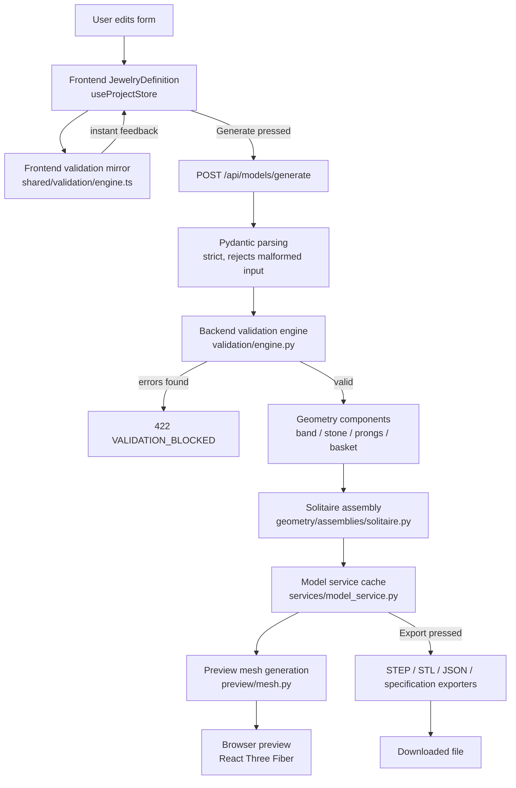

# System Map

## Data flow, end to end

```
User parameters
  -> frontend JewelryDefinition (Zustand store)
  -> frontend immediate validation (shared/validation/engine.ts)
  -> [Generate pressed] POST /api/models/generate
  -> backend Pydantic parsing (strict; rejects malformed input)
  -> authoritative backend validation (validation/engine.py)
  -> deterministic CadQuery builders (geometry/components/*.py)
  -> structured solitaire assembly (geometry/assemblies/solitaire.py)
  -> preview mesh generation (preview/mesh.py)
  -> browser preview (React Three Fiber, useComponentGeometries.ts)
  -> [Export pressed] STEP / STL / JSON / specification exporters
```

## Diagram



## Responsibilities by component

| Component | Responsibility | Does NOT do |
|---|---|---|
| **Frontend** (`frontend/src/`) | Render the form, show instant validation feedback, manage UI state (stale/loading/error), render the 3D preview from backend-provided meshes, trigger downloads. | Does not decide whether a definition is ultimately valid, does not generate geometry, does not write export files. |
| **Backend API** (`backend/jewelmind/api/`) | HTTP routing, request/response schemas, error-code mapping, CORS, request IDs, structured logging. | Does not itself validate business rules or build geometry — delegates to `validation/` and `services/`. |
| **Domain schema** (`backend/jewelmind/domain/`) | Defines the canonical `JewelryDefinition` shape and its type-level constraints (strict types, finite numbers, supported schema version). | Does not check cross-field business rules (e.g. "band width must be > 1.5mm") — that is `validation/`'s job. |
| **Validation engine** (`backend/jewelmind/validation/`) | Runs the sixteen deterministic business rules, returns severities, decides `has_errors()`. | Does not build geometry; does not know about CadQuery. |
| **Geometry components** (`backend/jewelmind/geometry/components/`) | Build one named solid each (band, stone, prongs, basket) from a validated definition. | Do not combine components into a full assembly; do not export files. |
| **Assembly builder** (`backend/jewelmind/geometry/assemblies/solitaire.py`) | Combines the four components, fuses metal, computes the definition hash and metadata. | Does not tessellate for preview or write export files. |
| **Preview service** (`backend/jewelmind/preview/`) | Tessellates each component to a binary STL mesh plus a manifest, for the browser to load. | Does not decide what "the preview" looks like visually — that's the frontend's material/color choices. |
| **Exporters** (`backend/jewelmind/exporters/`) | Write real STEP/STL files, canonical JSON, and the Markdown specification. | Do not validate the definition — that already happened before a model could exist to export. |
| **Model service** (`backend/jewelmind/services/model_service.py`) | Orchestrates validate -> generate -> cache -> export; owns temp file lifecycle. | Does not implement geometry or validation logic itself. |
| **Docker** (`docker-compose.yml`, `*/Dockerfile`) | Reproducible local runtime for both services. | Is not the only way to run JewelMind — see `docs/development.md` for the non-Docker workflow. |
| **GitHub Actions** (`.github/workflows/ci.yml`) | Automated backend tests, frontend tests/build, and a Docker smoke test on every push/PR to `main`. | Does not deploy anywhere — there is no deployment pipeline in this milestone. |

See [`02-architecture/023-data-flow.md`](../02-architecture/023-data-flow.md)
for a request-by-request walkthrough and
[`02-architecture/021-repository-map.md`](../02-architecture/021-repository-map.md)
for the file-level map.
