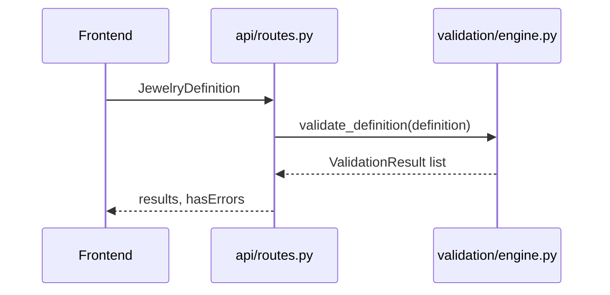
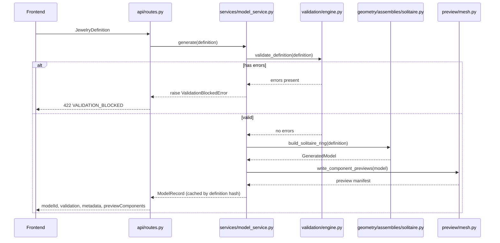
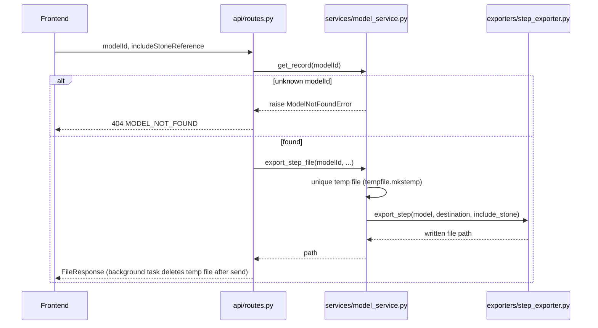

# Data Flow

Request-by-request walkthrough of the current system. Endpoint details
(exact request/response shapes) are in `docs/api.md` and
[`appendices/api-inventory.md`](../appendices/api-inventory.md); this
document is about *sequencing and responsibility handoff*.

**Relationship to JDL (Sprint 3):** the flows below are the current,
concrete instance of the eleven-stage JDL processing model in
[`05-jdl/063-jdl-processing-model.md`](../05-jdl/063-jdl-processing-model.md)
(JDL-0 through JDL-10). `validate_definition()` covers JDL-5/JDL-6,
`build_solitaire_ring()` covers JDL-7/JDL-8, and the exporters cover
JDL-10. This document does not restate that model; it shows exactly where
each stage lives in the running request/response sequence.

## `POST /api/models/validate`

Deliberately does not touch `model_service` or CadQuery at all (see
[`022-domain-boundaries.md`](022-domain-boundaries.md)) — this is why
validation keeps working even if the CAD engine is down.

## `POST /api/models/generate`

## `GET /api/models/{modelId}/preview/{componentName}`

The frontend calls this once per visible component after a successful
generate. Each call streams a real binary STL file from the model's temp
directory (`model_service.preview_file`) — see LAW-002.

## `POST /api/models/export/step` and `/export/stl`

STL follows the same shape, with an additional tolerance-validation step
in `api/schemas.py::ExportStlRequest` before the request even reaches the
handler (see [`013-functional-requirements.md`](../01-product/013-functional-requirements.md)
JM-FR-019/020).

## `POST /api/models/export/json` and `/specification`

Both resolve the cached `ModelRecord` by `modelId` and render from data
already present on it (`record.definition` and, for the specification,
`record.generated_at` — see JM-FR-017) — neither touches CadQuery again.

## Responsibility handoff summary

| Step | Owner | Hands off to |
|---|---|---|
| Instant feedback while typing | Frontend validation mirror | Nothing — purely advisory |
| Authoritative validation | Backend `validation/engine.py` | Geometry, only if valid |
| Geometry construction | `geometry/` | Assembly builder |
| Assembly + hashing | `geometry/assemblies/solitaire.py` | Model service cache |
| Caching + temp files | `services/model_service.py` | Preview / export on demand |
| Preview tessellation | `preview/mesh.py` | Frontend, via URL |
| File export | `exporters/` | Frontend, via download |
