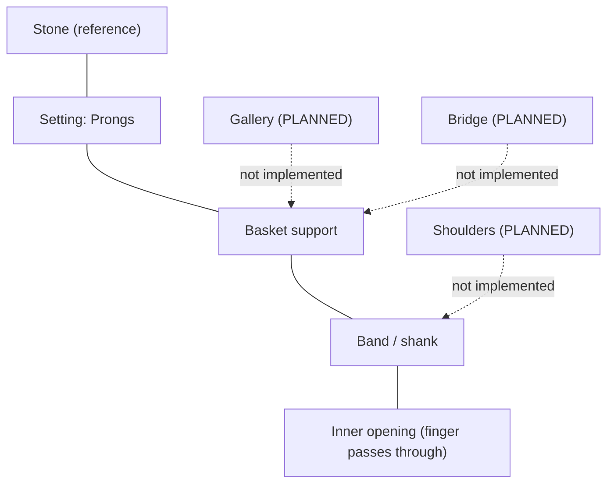
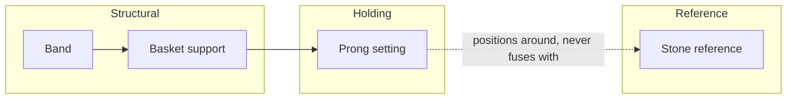

# Ring Anatomy

Conceptual anatomy of a ring, term by term. Each term states whether it
exists in current code, and if so, where — and if not, its status.
**The current simplified basket, prongs, and stone reference are not
claimed to be professionally complete representations of any of these
terms** — see each component's own limitations note.

| Term | Domain definition | In current code? | File (if applicable) | Relation to other components | Implementation status | Professional-validation status |
|---|---|---|---|---|---|---|
| **Band / shank** | The circular metal body that goes around the finger. | Yes | `backend/jewelmind/geometry/components/band.py` | Supports everything above it (setting, basket) | current | preliminary |
| **Inner opening** | The hole the finger passes through. | Yes (implicitly, as the band's inner radius) | `geometry/constants.py::inner_radius` | Defines the band's inner surface | current | preliminary |
| **Inner diameter** | The diameter of the inner opening. | Yes | `domain/schema.py::RingSpec.innerDiameter` | Drives band geometry (see [`052-parametric-dependency-model.md`](052-parametric-dependency-model.md)) | current | preliminary |
| **Outer diameter** | The diameter of the band's outer surface. | Yes (derived, not a stored field) | `geometry/constants.py::outer_radius` (`inner_radius + thickness`) | Derived from inner diameter + thickness | current | preliminary |
| **Width** | The band's extent along the finger axis. | Yes | `domain/schema.py::BandSpec.width` | Independent input parameter | current | preliminary |
| **Thickness** | The band's radial metal thickness. | Yes | `domain/schema.py::BandSpec.thickness` | Independent input parameter | current | preliminary |
| **Profile** | The band's cross-sectional shape. | Yes (`flat` or `comfort_fit`) | `domain/schema.py::BandSpec.profile`, `geometry/components/band.py` | Determines cross-section construction | current | preliminary |
| **Shoulders** | The transitional band sections leading up to the setting, often tapering or rising (e.g. cathedral style). | No | — | Would sit between `Band` and `ProngSetting`/`BasketSupport` | **PLANNED** | required (if implemented) |
| **Head** | The upper assembly holding the stone (setting + supporting structure), sometimes used as an umbrella term for setting + basket. | Partially — the current `ProngSetting` + `BasketSupport` together play this role, but "head" is not a named concept in code | `geometry/assemblies/solitaire.py` (implicitly, as the combination) | Combination of setting + basket | **PARTIAL** (concept not named in code) | preliminary |
| **Setting** | The mechanism holding the stone. | Yes (`ProngSetting` only) | `domain/schema.py::SettingSpec`, `geometry/components/prongs.py` | Connects stone to basket/band | current | preliminary |
| **Basket** | The structural support beneath the setting, connecting it to the band. | Yes (simplified) | `geometry/components/basket.py` | Connects setting to band | current (deliberately simplified) | preliminary |
| **Gallery** | Decorative open or filigreed structure, often part of or visible through the basket, between the stone and the band. | No | — | Would be a decorative variant of/addition to `BasketSupport` | **PLANNED** | required (if implemented) |
| **Bridge** | A structural connector, sometimes between basket and shoulders, distinct from the gallery. | No | — | Would connect `BasketSupport` to `Band`/shoulders | **PLANNED** | required (if implemented) |
| **Prongs** | The individual claws gripping the stone. | Yes (4 or 6, plain cylinders) | `geometry/components/prongs.py` | Attach to basket, contact stone girdle | current (deliberately simplified) | preliminary |
| **Stone** | The center gem (or its reference solid, in current code). | Yes, as a reference only | `geometry/components/stone.py` | Held by setting, separate from metal | current (reference only — see [`046-stone-domain.md`](046-stone-domain.md)) | preliminary |
| **Stone seat** | The precise surface/cut where a stone physically rests and is secured (e.g. a prong's bearing cut, a bezel's inner wall). | No | — | Would be part of `ProngSetting`/future setting types | **PLANNED** | required |
| **Girdle relationship** | How the setting's contact geometry relates to the stone's girdle (widest point). | Partially — prongs are radially positioned relative to the girdle radius, without a true seat/bearing | `geometry/constants.py::prong_center_radius` | Prong placement depends on stone girdle radius | **PARTIAL** | preliminary |
| **Support structures** | Any structural (non-decorative) element bearing load between stone/setting and band. | Yes, as `BasketSupport` | `geometry/components/basket.py` | See Basket | current (simplified) | preliminary |
| **Decorative elements** | Any element present for appearance rather than structure (filigree, milgrain, engraving borders, etc.). | No | — | Would attach to band/shoulders/gallery | **VISION** | required |
| **Engraving** | Text or pattern cut into the metal (commonly on the interior band surface). | No | — | Would be a band surface modification | **VISION** | required |
| **Internal relief / weight-reduction structures** | Interior material removed to reduce weight/cost while preserving structural integrity. | No | — | Would modify `Band`/`BasketSupport` interior geometry | **VISION** | required |

## Conceptual diagram — vertical anatomy (side view)

Solid lines: current, code-backed relationships. Dashed lines: planned
concepts with no current implementation, shown only to place them
conceptually relative to what exists.

## Conceptual diagram — component responsibility

The dashed relationship between setting and stone is deliberate: it
mirrors [LAW-006](../00-foundation/004-jewelmind-constitution.md#LAW-006)
— the stone reference is geometrically positioned relative to the
setting but is never unioned into the metal body.
