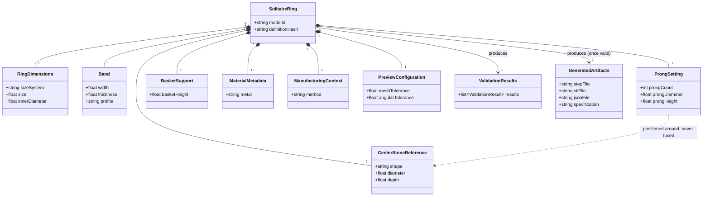
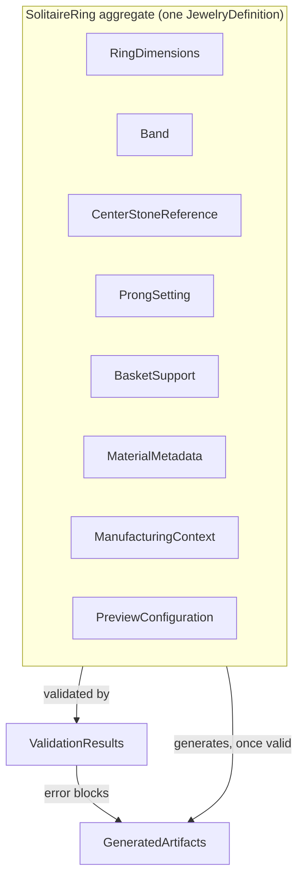

# Solitaire Domain Model

This is the central document of Sprint 2: the current solitaire ring,
modeled as a domain aggregate, with every component classified by kind
(domain entity, value object, parameter set, geometric component,
metadata, manufacturing context, or generated artifact).

**Relationship to JDL (Sprint 3):** this document describes the solitaire
ring as a *jewelry concept*; [`05-jdl/064-canonical-document-model.md`](../05-jdl/064-canonical-document-model.md)
describes the identical information as a *data type* (`JDLDocumentV1`),
concluding it is fully equivalent to the current `JewelryDefinition`. Where
the two overlap, this document remains authoritative for jewelry meaning;
the JDL document is authoritative for field-level type/serialization
concerns.

## Kind definitions

| Kind | Meaning |
|---|---|
| **DOMAIN ENTITY** | An object with identity or a lifecycle distinct from its current values (e.g. a generated model, identified by its definition hash). |
| **VALUE OBJECT** | A descriptive, immutable value with no identity of its own (e.g. a bounding box). |
| **PARAMETER SET** | A group of inputs controlling geometry and/or validation (e.g. band dimensions). |
| **GEOMETRIC COMPONENT** | A component that produces real CadQuery geometry. |
| **METADATA** | Information that does not currently alter geometry (e.g. metal choice's visual-only effect). |
| **MANUFACTURING CONTEXT** | Information influencing validation or future production rules, without itself being geometry. |
| **GENERATED ARTIFACT** | An output file or representation derived from a generated model (STEP, STL, preview mesh, JSON, specification). |

## Aggregate structure

```
SolitaireRing
├── RingIdentity            (DOMAIN ENTITY — conceptual; see below)
├── RingDimensions           (PARAMETER SET)
├── Band                     (GEOMETRIC COMPONENT)
├── CenterStoneReference     (GEOMETRIC COMPONENT)
├── ProngSetting             (GEOMETRIC COMPONENT)
├── BasketSupport            (GEOMETRIC COMPONENT)
├── MaterialMetadata         (METADATA)
├── ManufacturingContext     (MANUFACTURING CONTEXT)
├── PreviewConfiguration     (PARAMETER SET)
├── ValidationResults        (VALUE OBJECT, one per validation run)
└── GeneratedArtifacts       (GENERATED ARTIFACT, one set per generated model)
```

## Component-by-component

### `RingIdentity`

- **Responsibility:** conceptually names "this specific generated model" —
  in current code this is the `modelId` / `definitionHash` pair, not a
  separate class.
- **Parameters:** none of its own; derived from the canonical definition.
- **Required/optional:** implicitly required — every generated model has one.
- **Relationships:** 1:1 with a `GeneratedModel` cache entry.
- **Invariants:** the same canonical definition always yields the same
  identity (see [`053-domain-invariants.md`](053-domain-invariants.md)).
- **Generated geometry:** none directly.
- **Metadata:** `generatorVersion`, `generatedAt`, `generationDurationSeconds`.
- **Current code mapping:** `backend/jewelmind/utils/hashing.py::definition_hash`,
  `backend/jewelmind/services/model_service.py::ModelRecord`.
- **Current limitations:** not represented as a first-class named type;
  it is a derived string plus a few scattered fields on `ModelRecord`/`GeneratedModel`.

### `RingDimensions`

- **Responsibility:** the ring-level sizing inputs (as opposed to band-
  or stone-specific ones).
- **Parameters:** `sizeSystem` (fixed `"EU"`), `size`, `innerDiameter`.
- **Required/optional:** all required (have schema defaults).
- **Relationships:** `innerDiameter` directly drives `Band` geometry (see
  [`052-parametric-dependency-model.md`](052-parametric-dependency-model.md)).
  `size` and `innerDiameter` are cross-checked for consistency
  (`JM-RING-003`) but neither is derived from the other automatically.
- **Invariants:** `innerDiameter` strictly between 10 and 30mm
  (`JM-RING-001`); `size` strictly between 1 and 50 (`JM-RING-002`).
- **Generated geometry:** none directly — feeds `Band`.
- **Metadata:** none beyond the parameters themselves.
- **Current code mapping:** `domain/schema.py::RingSpec`.
- **Current limitations:** only the EU/French sizing convention is
  supported (see [`validation-rules.md`](../../validation-rules.md) and
  [`057-open-domain-questions.md`](057-open-domain-questions.md)).

### `Band` — see [`045-band-domain.md`](045-band-domain.md) for full detail

- **Kind:** GEOMETRIC COMPONENT.
- **Responsibility:** the ring's metal shank.
- **Required/optional:** required — always present in a generated model.
- **Current code mapping:** `geometry/components/band.py`.

### `CenterStoneReference` — see [`046-stone-domain.md`](046-stone-domain.md)

- **Kind:** GEOMETRIC COMPONENT (explicitly a *reference*, not
  manufacturable metal).
- **Responsibility:** visual/dimensional stand-in for the center stone.
- **Required/optional:** required in the sense that it is always
  generated; optional in exports (`includeStoneReference`, default
  `false`).
- **Current code mapping:** `geometry/components/stone.py`.

### `ProngSetting` — see [`047-setting-domain.md`](047-setting-domain.md) and [`048-prong-domain.md`](048-prong-domain.md)

- **Kind:** GEOMETRIC COMPONENT.
- **Responsibility:** holds the stone reference in position (visually/
  dimensionally; not a manufacturable stone-setting mechanism).
- **Required/optional:** required.
- **Current code mapping:** `geometry/components/prongs.py`.

### `BasketSupport` — see [`049-basket-and-support-domain.md`](049-basket-and-support-domain.md)

- **Kind:** GEOMETRIC COMPONENT.
- **Responsibility:** structurally connects the setting to the band.
- **Required/optional:** required.
- **Current code mapping:** `geometry/components/basket.py`.

### `MaterialMetadata` — see [`050-material-domain.md`](050-material-domain.md)

- **Kind:** METADATA.
- **Responsibility:** records the selected metal for display/labeling.
- **Required/optional:** required (has a default).
- **Current code mapping:** `domain/schema.py::MaterialSpec`.
- **Current limitations:** does not affect geometry.

### `ManufacturingContext` — see [`051-manufacturing-context.md`](051-manufacturing-context.md)

- **Kind:** MANUFACTURING CONTEXT.
- **Responsibility:** records the intended manufacturing method, which
  affects one validation rule (`JM-MANUFACTURING-001`).
- **Required/optional:** required (has a default).
- **Current code mapping:** `domain/schema.py::ManufacturingSpec`.

### `PreviewConfiguration`

- **Kind:** PARAMETER SET.
- **Responsibility:** controls mesh tessellation quality for preview and
  STL export, not the B-Rep solid itself.
- **Parameters:** `meshTolerance`, `angularTolerance` (both must be
  finite and `> 0`).
- **Required/optional:** required (has defaults).
- **Relationships:** affects `GeneratedArtifacts` (preview meshes, STL
  file size/detail), not `Band`/`CenterStoneReference`/etc.'s exact solid
  geometry.
- **Current code mapping:** `domain/schema.py::PreviewSpec`.

### `ValidationResults`

- **Kind:** VALUE OBJECT (one immutable list per validation run).
- **Responsibility:** the outcome of running all sixteen rules against a
  definition.
- **Required/optional:** always produced, for both a live edit and a
  generate/export attempt.
- **Current code mapping:** `validation/rules.py::ValidationResult`,
  `validation/engine.py::validate_definition`.

### `GeneratedArtifacts`

- **Kind:** GENERATED ARTIFACT (a set: preview meshes + on-demand export
  files).
- **Responsibility:** the tangible outputs a user takes away — preview
  STL per component, exported STEP, exported STL, exported JSON,
  technical specification.
- **Required/optional:** preview meshes are produced at generation time;
  STEP/STL/JSON/specification are produced on demand, per export request.
- **Current code mapping:** `preview/mesh.py`, `exporters/`.

## Class diagram



## Aggregate boundary diagram



The aggregate boundary matters: everything inside it is validated and
generated as one unit (`services/model_service.py::generate`) — there is
no partial generation of, say, only the band without the rest.

## Current limitations of this aggregate

- `RingIdentity` is not a first-class type — it is implied by
  `definitionHash`/`modelId` scattered across `ModelRecord`/`GeneratedModel`.
- `head` (the informal umbrella term combining setting + basket) has no
  corresponding code concept — see
  [`043-ring-anatomy.md`](043-ring-anatomy.md).
- The aggregate has no concept of *partial* validity for export purposes
  beyond the single pass/fail `hasErrors` check — see
  [`053-domain-invariants.md`](053-domain-invariants.md) for the workflow
  invariants this produces.
