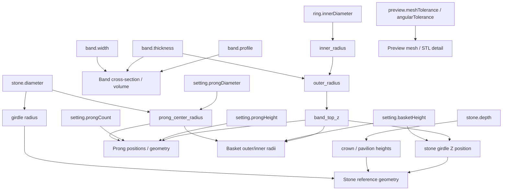

# Parametric Dependency Model

Every dependency below is read directly from
`backend/jewelmind/geometry/` and `backend/jewelmind/validation/engine.py`
— none is inferred or assumed.

**Relationship to JDL (Sprint 3):** [`05-jdl/078-geometry-generation-contract.md`](../05-jdl/078-geometry-generation-contract.md)
restates this same dependency data as a per-component input/derived-value/output
contract, for compiler-implementer purposes. That document does not
introduce any dependency not already listed here — see open question
JDL-OQ-007 in [`05-jdl/086-open-jdl-questions.md`](../05-jdl/086-open-jdl-questions.md)
for whether `material.metal`/`manufacturing.method` should ever gain a
geometry dependency in the future.

**Relationship to Atlas (Sprint 5):** [`07-atlas/149-current-solitaire-geometry-mapping.md`](../07-atlas/149-current-solitaire-geometry-mapping.md)
is the most granular current restatement of this table — a full
JDL-path-to-CadQuery-operation trace for every geometry-driving field,
including two cross-component dependencies (`setting.basketHeight` also
placing the stone; `stone.diameter` also sizing the prongs/basket radii)
made explicit there for the first time.

## Dependency table

| Input | Directly affects | Code reference |
|---|---|---|
| `ring.innerDiameter` | `inner_radius`, `outer_radius`, `band_top_z` (and therefore the entire assembly's vertical anchor), band bounding box, total metal volume | `geometry/constants.py::inner_radius/outer_radius/band_top_z` |
| `band.width` | Band cross-section (extent along Y), band volume, visual proportions | `geometry/components/band.py` |
| `band.thickness` | Band cross-section (radial extent), `outer_radius` (and therefore `band_top_z`), band volume, `JM-BAND-002`/`JM-GEOMETRY-001` validation | `geometry/components/band.py`, `geometry/constants.py::outer_radius` |
| `band.profile` | Which cross-section construction path runs (flat vs. comfort-fit), band volume | `geometry/components/band.py` |
| `stone.diameter` | Stone reference girdle radius, `prong_center_radius` (and therefore prong + basket positioning), `JM-STONE-001`/`JM-PRONG-003` validation | `geometry/constants.py::prong_center_radius`, `geometry/components/stone.py` |
| `stone.depth` | Stone reference crown/pavilion heights (vertical geometry only — no downstream effect on prongs/basket), `JM-STONE-002` validation | `geometry/components/stone.py` |
| `setting.prongCount` | Number of prong solids generated, angular distribution, `JM-PRONG-001`/`JM-PRONG-003` validation | `geometry/components/prongs.py::_prong_positions` |
| `setting.prongDiameter` | Prong cylinder radius, `prong_center_radius` (and therefore basket wall radii), prong metal volume, `JM-PRONG-002` validation | `geometry/constants.py::prong_center_radius`, `geometry/components/prongs.py`, `geometry/components/basket.py` |
| `setting.prongHeight` | Prong cylinder height, `JM-PRONG-004` invariant (must exceed `basketHeight`) | `geometry/components/prongs.py` |
| `setting.basketHeight` | Basket support height, stone reference girdle Z position (`girdle_z = band_top_z + basketHeight`), `JM-PRONG-004`/`JM-SETTING-001`/`JM-SETTING-002` validation | `geometry/components/basket.py`, `geometry/components/stone.py::build_stone_reference` |
| `preview.meshTolerance` / `preview.angularTolerance` | Mesh triangle density for preview and STL export **only** — never affects the underlying B-Rep solid | `preview/mesh.py`, `exporters/stl_exporter.py` |
| `material.metal` | Preview display color only (see [`050-material-domain.md`](050-material-domain.md)) | `frontend/src/components/ModelViewport.tsx` |
| `manufacturing.method` | `JM-MANUFACTURING-001` validation context only | `validation/engine.py::_manufacturing_rules` |

## Direct vs. derived parameters

| Direct (stored in `JewelryDefinition`) | Derived (computed, never stored) |
|---|---|
| `ring.innerDiameter`, `ring.size` | `inner_radius`, `outer_radius`, `band_top_z` |
| `band.width`, `band.thickness`, `band.profile` | Band cross-section geometry |
| `stone.diameter`, `stone.depth` | Girdle radius, crown/pavilion heights, table radius |
| `setting.prongCount`, `prongDiameter`, `prongHeight`, `basketHeight` | `prong_center_radius`, prong positions, basket inner/outer radii, stone girdle Z |
| `material.metal`, `manufacturing.method` | (metadata only — nothing further derived) |
| `preview.meshTolerance`, `angularTolerance` | Mesh vertex/triangle counts |

## Dependency graph

Note that `preview.meshTolerance`/`angularTolerance` is deliberately drawn
with no edge into any of the B-Rep geometry nodes — it affects only the
tessellation step, never the exact solid.

## Stale-model implications

Because every geometric output above ultimately traces back to at least
one direct parameter, **any** change to a direct parameter invalidates
the entire previously-generated model, not just the component that
parameter "belongs" to. This is why
`frontend/src/store/useProjectStore.ts` marks the *whole* generated model
stale on *any* field change, rather than tracking per-component
staleness — a targeted per-component recomputation is not currently
implemented and would require confirming no cross-component dependency
was missed (e.g. `stone.diameter` affecting prong/basket geometry, not
just the stone itself).

## Recomputation requirements

A regeneration always rebuilds all four components
(`build_solitaire_ring`) from the full definition — there is no partial
recomputation path in the current code. This matches the aggregate
boundary in
[`044-solitaire-domain-model.md`](044-solitaire-domain-model.md): the
`SolitaireRing` aggregate is generated as one unit.
