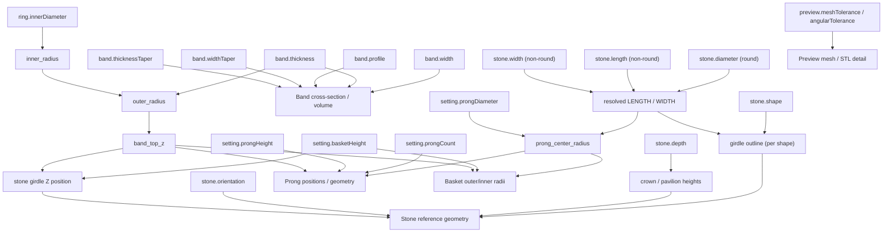

# Parametric Dependency Model

Every dependency below is read directly from
`backend/jewelmind/geometry/` and `backend/jewelmind/validation/engine.py`
— none is inferred or assumed.

**Relationship to JDL (Sprint 3):** [`05-jdl/078-geometry-generation-contract.md`](../05-jdl/078-geometry-generation-contract.md)
restates this same dependency data as a per-component input/derived-value/output
contract, for compiler-implementer purposes. That document does not
introduce any dependency not already listed here — see open question
JDL-OQ-007 in [`05-jdl/086-open-jdl-questions.md`](../05-jdl/086-open-jdl-questions.md)
for whether `material.metal`/`manufacturing.method` should ever gain a
geometry dependency in the future.

**Relationship to Atlas (Sprint 5):** [`07-atlas/149-current-solitaire-geometry-mapping.md`](../07-atlas/149-current-solitaire-geometry-mapping.md)
is the most granular current restatement of this table — a full
JDL-path-to-CadQuery-operation trace for every geometry-driving field,
including two cross-component dependencies (`setting.basketHeight` also
placing the stone; the stone's resolved WIDTH also sizing the prongs/basket radii)
made explicit there for the first time.

## Dependency table

| Input | Directly affects | Code reference |
|---|---|---|
| `ring.innerDiameter` | `inner_radius`, `outer_radius`, `band_top_z` (and therefore the entire assembly's vertical anchor), band bounding box, total metal volume | `geometry/constants.py::inner_radius/outer_radius/band_top_z` |
| `band.width` | Band cross-section (extent along Y) at the head (`u=0`), band volume, visual proportions | `geometry/shank/builder.py` |
| `band.thickness` | Band cross-section (radial extent) at the head (`u=0`), `outer_radius` (and therefore `band_top_z`), band volume, `JM-BAND-002`/`JM-GEOMETRY-001` validation | `geometry/shank/builder.py`, `geometry/constants.py::outer_radius` |
| `band.profile` | Which cross-section construction path runs (flat vs. comfort-fit) at every sampled section, band volume | `geometry/shank/profile.py` |
| `band.widthTaper.mode`/`.bottomRatio` (Sprint 17) | Whether/how much `band.width` is reduced moving away from the head toward the bottom (`u=0.5`); selects the uniform-revolve vs 48-section tapered-loft construction path; band volume | `geometry/shank/taper.py`, `builder.py` |
| `band.thicknessTaper.mode`/`.bottomRatio` (Sprint 17) | Whether/how much `band.thickness` is reduced moving away from the head toward the bottom (`u=0.5`); selects the uniform-revolve vs 48-section tapered-loft construction path; band volume | `geometry/shank/taper.py`, `builder.py` |
| `stone.shape` (Sprint 18) | Which outline primitive builds the stone reference, and therefore its whole horizontal silhouette and volume; also gates which Forge rules apply (`JM-STONE-001`/`JM-PRONG-003` are ROUND_ONLY) | `geometry/stone/builder.py`, `geometry/stone/outline.py`, `validation/engine.py` |
| `stone.diameter` | ROUND_ONLY. Round's girdle radius; via `resolved_width_mm()` also `prong_center_radius` (and therefore prong + basket positioning); `JM-STONE-001`/`JM-PRONG-003` validation | `geometry/constants.py::prong_center_radius`, `geometry/stone/builder.py`, `domain/stone_dimensions.py` |
| `stone.length` (Sprint 18) | Non-round major horizontal extent (local Y) of the stone reference outline; participates in `JM-STONE-002` via `min(length, width)` | `geometry/stone/outline.py`, `domain/stone_dimensions.py` |
| `stone.width` (Sprint 18) | Non-round minor horizontal extent (local X); via `resolved_width_mm()` drives `prong_center_radius` and therefore prong + basket positioning; participates in `JM-STONE-002` | `geometry/stone/outline.py`, `geometry/constants.py::prong_center_radius`, `domain/stone_dimensions.py` |
| `stone.depth` | Stone reference crown/pavilion heights (vertical geometry only — no downstream effect on prongs/basket), `JM-STONE-002` validation | `geometry/stone/builder.py` |
| `stone.orientation` (Sprint 18) | Rotation of the finished stone solid around its own local vertical axis; changes the stone's bounding box but nothing downstream (prong/basket placement is orientation-independent) | `geometry/stone/builder.py::_apply_orientation` |
| `setting.prongCount` | Number of prong solids generated, angular distribution, `JM-PRONG-001`/`JM-PRONG-003` validation | `geometry/components/prongs.py::_prong_positions` |
| `setting.prongDiameter` | Prong cylinder radius, `prong_center_radius` (and therefore basket wall radii), prong metal volume, `JM-PRONG-002` validation | `geometry/constants.py::prong_center_radius`, `geometry/components/prongs.py`, `geometry/components/basket.py` |
| `setting.prongHeight` | Prong cylinder height, `JM-PRONG-004` invariant (must exceed `basketHeight`) | `geometry/components/prongs.py` |
| `setting.basketHeight` | Basket support height, stone reference girdle Z position (`girdle_z = band_top_z + basketHeight`), `JM-PRONG-004`/`JM-SETTING-001`/`JM-SETTING-002` validation | `geometry/components/basket.py`, `geometry/components/stone.py::build_stone_reference` |
| `band.architecture` (Sprint 28) | Which shank construction runs: `UNIFORM` keeps the pre-Sprint-17 revolve, `SPLIT` builds two rails plus a bottom bridge, `BYPASS` builds one open rail over a full turn plus the overlap. Changes the band's whole topology and volume | `geometry/shank/builder.py::_build_architecture`, `geometry/shank/architecture.py` |
| `band.splitSeparation` (Sprint 28) | The axial gap between a split shank's rails, AND — because the rails SHARE the band's width — the rails' own width: `(width - separation) / 2`. A wider separation NARROWS them. `JM-RINGFAM-004` validation | `geometry/shank/architecture.py::rail_half_width`, `validation/engine.py::_ring_family_rules` |
| `band.splitJoinSpan` (Sprint 28) | How much of the ring's bottom the two rails are joined over, and therefore the bridge's volume and where the rails separate | `geometry/shank/architecture.py::build_split_shank` |
| `band.bypassSeparation` (Sprint 28) | The axial distance a bypass rail travels across its sweep, and therefore the clearance between its two passes at the crossing. Also the rail's own width, for the same shared-width reason | `geometry/shank/architecture.py::build_bypass_shank` |
| `band.bypassOverlap` (Sprint 28) | How far past a full turn the bypass rail travels — what makes its ends pass rather than meet — and therefore the swept angle, the section count and the volume | `geometry/shank/architecture.py::build_bypass_shank` |
| `ringFamily.variant` (Sprint 28) | Which family variant resolves, and therefore which JDL paths are DERIVED: the shank architecture, the shoulder architecture, the body architecture, the head-height factor, and the `family`/`halo`/`pave` blocks. THE INDIRECTION IS THE POINT: a variant changes the document, and the document drives the geometry | `ring_family/resolve.py::resolve_ring_family`, `geometry/ring_family_adapter.py` |
| `ringFamily.params.*` (Sprint 28) | Every derived value the chosen variant computes. Each parameter MODULATES a document value rather than replacing it — `setting.basketHeight x variant factor x headHeightFactor`, a halo radius times the centre stone's own half width — which is what keeps `ring.innerDiameter` and `stone.diameter` driving the geometry. A parameter the variant does not read has no effect and `JM-RINGFAM-003` says so | `ring_family/resolve.py`, `ring_family/dependencies.py` |
| `ringFamily.params.eternityPitchMm` / `eternityStoneCount` / `eternityStoneSpacingMm` / `eternityStoneScale` / `eternityStartAngleDeg` / `eternityRetention` (Sprint 29) | The derived `pave` block, and therefore the whole set band: how many stones, where they sit, how big they are relative to the design's own stone, and what metal holds them. A FULL band states a PITCH and its count FOLLOWS the band's circumference; a HALF band states a COUNT and the two leave the unadorned region | `ring_family/resolve.py`, then the Pave Engine and `setting/retention.py` |
| `ringFamily.params.clusterStoneCount` / `clusterRadiusMm` / `clusterStoneScale` (Sprint 29) | The derived `family` block for a CLUSTER, and therefore the accent stones' count, exact radius and size. Every POSITION is computed by the arrangement resolver; the ring family states only the topology | `ring_family/resolve.py`, then `family/compile.py` and the arrangement resolver |
| `ringFamily.params.toiEtMoiSecondScale` / `toiEtMoiSeparationMm` / `toiEtMoiOrientationDeg` (Sprint 29) | The derived `family` block and its two members for a TOI_ET_MOI: the second stone's size relative to the first, the exact centre-to-centre separation, and the angle the pair sits at in the ring's horizontal plane. The two stones cannot differ in CUT — a member carries no shape | `ring_family/resolve.py`, then `family/compile.py` |
| `preview.meshTolerance` / `preview.angularTolerance` | Mesh triangle density for preview and STL export **only** — never affects the underlying B-Rep solid | `preview/mesh.py`, `exporters/stl_exporter.py` |
| `material.metal` | Preview display color only (see [`050-material-domain.md`](050-material-domain.md)) | `frontend/src/components/ModelViewport.tsx` |
| `manufacturing.method` | `JM-MANUFACTURING-001` validation context only | `validation/engine.py::_manufacturing_rules` |

## Direct vs. derived parameters

| Direct (stored in `JewelryDefinition`) | Derived (computed, never stored) |
|---|---|
| `ring.innerDiameter`, `ring.size` | `inner_radius`, `outer_radius`, `band_top_z` |
| `band.width`, `band.thickness`, `band.profile`, `band.widthTaper`, `band.thicknessTaper` | Band cross-section geometry (uniform or tapered) |
| `stone.shape`, `stone.diameter`, `stone.length`, `stone.width`, `stone.depth`, `stone.orientation` | Resolved LENGTH/WIDTH/DEPTH, girdle outline (per shape), crown/pavilion heights, table-level outline; girdle/table radius for round only |
| `setting.prongCount`, `prongDiameter`, `prongHeight`, `basketHeight` | `prong_center_radius`, prong positions, basket inner/outer radii, stone girdle Z |
| `material.metal`, `manufacturing.method` | (metadata only — nothing further derived) |
| `preview.meshTolerance`, `angularTolerance` | Mesh vertex/triangle counts |

## Dependency graph

Note that `preview.meshTolerance`/`angularTolerance` is deliberately drawn
with no edge into any of the B-Rep geometry nodes — it affects only the
tessellation step, never the exact solid.

## Stale-model implications

Because every geometric output above ultimately traces back to at least
one direct parameter, **any** change to a direct parameter invalidates
the entire previously-generated model, not just the component that
parameter "belongs" to. This is why
`frontend/src/store/useProjectStore.ts` marks the *whole* generated model
stale on *any* field change, rather than tracking per-component
staleness — a targeted per-component recomputation is not currently
implemented and would require confirming no cross-component dependency
was missed (e.g. the stone's resolved WIDTH — `stone.diameter` for round,
`stone.width` otherwise — affecting prong/basket geometry, not just the
stone itself).

## Recomputation requirements

A regeneration always rebuilds all four components
(`build_solitaire_ring`) from the full definition — there is no partial
recomputation path in the current code. This matches the aggregate
boundary in
[`044-solitaire-domain-model.md`](044-solitaire-domain-model.md): the
`SolitaireRing` aggregate is generated as one unit.
