# JDL Language Overview

JDL (Jewelry Definition Language) is the language and semantic contract that describes a piece of jewelry as data: what it is, how big it is, what it's made of, and how it should be manufactured — independent of which tool authored it or which tool consumes it. It is not a file format; it is the set of rules that make a document like `specs/jdl/v1/examples/default-solitaire.json` mean the same thing everywhere: in the frontend form, in the backend validator, in the geometry generator, in an exported specification, and (in the future) to an AI system asked to interpret one.

## Conceptual pipeline

```mermaid
flowchart LR
    A[Authoring representation] --> B[Parser]
    B --> C[Syntax validation]
    C --> D[Canonical JDL Document]
    D --> E[Schema validation]
    E --> F[Semantic validation]
    F --> G[Jewelry-domain validation]
    G --> H[Geometry planning]
    H --> I[Deterministic geometry generation]
    I --> J[Model inspection]
    J --> K[Artifact generation]
```

## Current vs. planned, stage by stage

| Stage | Status | Where it happens today |
|---|---|---|
| Authoring representation | CURRENT (JSON only) | Frontend form state / any hand-written JSON |
| Parser | CURRENT, trivial | `json` deserialization inside FastAPI's request body handling; there is no separate JDL parser module — see [`063-jdl-processing-model.md`](063-jdl-processing-model.md) |
| Syntax validation | CURRENT, folded into schema validation | Malformed JSON is a FastAPI/Starlette-level 422 before Pydantic ever runs |
| **Canonical JDL Document** | CURRENT | The `JewelryDefinition` instance returned by `JewelryDefinition.model_validate()` |
| Schema validation | CURRENT | Pydantic (`backend/jewelmind/domain/schema.py`); mirrored, non-authoritative, by `specs/jdl/v1/jdl.schema.json` |
| Semantic validation | CURRENT | `backend/jewelmind/validation/engine.py::validate_definition()` |
| Jewelry-domain validation | CURRENT (same engine; see Sprint 2) | Same file — JDL does not introduce a separate domain-validation pass; see [`04-jewelry-domain/054-domain-validation-classification.md`](../04-jewelry-domain/054-domain-validation-classification.md) |
| Geometry planning | PARTIAL — not a separate artifact today | Implicit inside `build_solitaire_ring()`; see [`077-compiler-contract.md`](077-compiler-contract.md) |
| Deterministic geometry generation | CURRENT | `backend/jewelmind/geometry/assemblies/solitaire.py` |
| Model inspection | CURRENT | Volumes/bounding boxes computed as part of generation; see [`078-geometry-generation-contract.md`](078-geometry-generation-contract.md) |
| Artifact generation | CURRENT | `backend/jewelmind/exporters/*` (STEP, STL, JSON, specification) |

**The current implementation begins from Canonical JSON.** There is no textual parser, no YAML loader, and no separate "authoring representation → parser → syntax validation" module — a JSON request body either deserializes and validates against Pydantic, or it doesn't. This overview names the stages that a general JDL implementation could have; it does not claim JewelMind has built all of them.

## Why formalize this now, in Sprint 3

Sprint 2 fixed what a solitaire ring *means* (the jewelry-domain model). This Sprint fixes how that meaning is *expressed and consumed as data* — a prerequisite for: a future textual authoring syntax, any AI system that needs a stable target to produce (never to invent geometry from, per CLAUDE.md), a second frontend or CLI client, and long-term backward compatibility as `schemaVersion` evolves.

## Relationship to `docs/api.md` and `docs/geometry-conventions.md`

Those files remain authoritative for HTTP-level request/response shapes and the 3D coordinate convention respectively. JDL does not restate either; it is the layer above both — the meaning of the data those documents carry.
