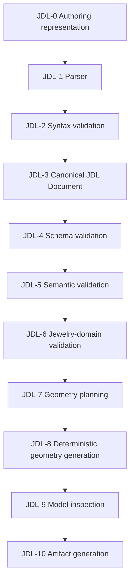

# JDL Processing Model (JDL-0..JDL-10)

## Stage table

| Stage | Input | Output | Responsibilities | Prohibited | Diagnostics | Status | Current code | Tests |
|---|---|---|---|---|---|---|---|---|
| **JDL-0** Authoring representation | User/tool intent | Raw JSON text | Hold whatever a human or tool produced | None (pre-validation) | none | CURRENT (JSON only) | Frontend `useProjectStore.ts` state, or any hand-written file | — |
| **JDL-1** Parser | Raw JSON text | Parsed object graph | Turn bytes into a language-native structure | Must not evaluate expressions or fetch external resources | `JDL-PARSE-*` | CURRENT, trivial (standard JSON deserialization) | FastAPI request-body decoding | `backend/tests/test_api.py` (malformed-body cases) |
| **JDL-2** Syntax validation | Parsed object graph | Pass/fail | Reject malformed JSON before semantic work begins | Must not apply business rules here | `JDL-PARSE-*` | CURRENT, folded into FastAPI/Starlette's 422 handling | `api/app.py` exception handlers | `backend/tests/test_api_hardening.py` |
| **JDL-3** Canonical JDL Document | Parsed object graph | A `JewelryDefinition` instance (post-default-filling) | Establish the one normalized in-memory form everything downstream shares | Must not skip default-filling | none (this stage produces a value, not a diagnostic) | CURRENT | `JewelryDefinition.model_validate()` | `backend/tests/test_schema.py` |
| **JDL-4** Schema validation | Canonical JDL Document candidate | Pass, or `JDL-SCHEMA-*` diagnostics | Enforce types, literals/enums, `additionalProperties: false` | Must not enforce numeric business thresholds (those belong to JDL-5/6) | `JDL-SCHEMA-*` | CURRENT | Pydantic `StrictModel` classes in `domain/schema.py`; mirrored non-authoritatively by `specs/jdl/v1/jdl.schema.json` | `backend/tests/test_schema_safety.py`, `backend/tests/test_jdl_schema_examples.py` |
| **JDL-5** Semantic validation | Canonical JDL Document | `ValidationResult` list | Apply numeric/consistency rules that don't require jewelry-manufacturing knowledge (ranges, positivity, internal consistency) | Must not silently mutate the document | `JM-*` (see [`jdl-error-code-catalog.md`](../appendices/jdl-error-code-catalog.md)) | CURRENT | `validation/engine.py` | `backend/tests/test_validation.py` |
| **JDL-6** Jewelry-domain validation | Canonical JDL Document | `ValidationResult` list | Apply rules that encode jewelry-domain judgment (e.g. prong count vs. stone size) | Must not claim professional certification | `JM-*` (same engine; see [`04-jewelry-domain/054-domain-validation-classification.md`](../04-jewelry-domain/054-domain-validation-classification.md)) | CURRENT — same engine as JDL-5, not a separately implemented pass | `validation/engine.py` (`_prong_rules`, `_manufacturing_rules`) | `backend/tests/test_validation.py` |
| **JDL-7** Geometry planning | Validated Canonical JDL Document | A plan of which components to build and with what derived values | Decide component list and derived dimensions before touching the CAD kernel | Must not generate geometry yet | none published separately today | PARTIAL — not a separate artifact; folded into JDL-8 | `geometry/assemblies/solitaire.py::build_solitaire_ring()` (implicit) | `backend/tests/test_geometry.py` |
| **JDL-8** Deterministic geometry generation | Plan (or, currently, the document directly) | `GeneratedModel` (CadQuery/OCCT solids + metadata) | Build real B-Rep solids; never non-deterministic; never LLM-driven | Must not fall back to a placeholder shape | `JM-GEOMETRY-*` | CURRENT | `geometry/assemblies/solitaire.py`, `geometry/components/*.py` | `backend/tests/test_geometry.py` |
| **JDL-9** Model inspection | `GeneratedModel` | Volumes, bounding boxes, warnings | Compute and expose measurable facts about the generated solids | Must not hide a fallback path from the caller | none (data, not diagnostics) | CURRENT | `geometry/model.py` (`BoundingBox`, `GeneratedComponent`) | `backend/tests/test_geometry.py` |
| **JDL-10** Artifact generation | `GeneratedModel` + original definition | STEP/STL/JSON/specification files | Produce real, on-disk, real-geometry artifacts | Must never write a stub/placeholder file (see CLAUDE.md "Never fake an export") | `JM-EXPORT-*` | CURRENT | `exporters/step_exporter.py`, `stl_exporter.py`, `json_exporter.py`, `specification.py` | `backend/tests/test_api.py` (export endpoints) |

## Reading this table correctly

JDL-5 and JDL-6 are listed as separate conceptual stages because they answer different questions ("is this internally consistent" vs. "does this reflect jewelry-making judgment"), but **the current implementation runs them as one pass** (`validate_definition()` calls both kinds of rule functions in the same list — see `_RULE_GROUPS` in `backend/jewelmind/validation/engine.py`). This table documents the conceptual distinction the Bible already uses (Sprint 2's IMPLEMENTED FACT / PRELIMINARY SOFTWARE RULE split runs across both); it does not claim two separate engines exist.
