# Rule System Overview

## Conceptual pipeline

```mermaid
flowchart LR
    A[JDL Canonical Document] --> B[Forge Context]
    B --> C[Rule Selection]
    C --> D[Rule Ordering]
    D --> E[Rule Evaluation]
    E --> F[Rule Results]
    F --> G[Diagnostics]
    G --> H[Geometry Eligibility]
    H --> I[Geometry Generation]
    I --> J[Geometry Inspection]
    J --> K[Export Eligibility]
```

## Rule categories

Eleven categories, defined in full in [`093-rule-classification-model.md`](093-rule-classification-model.md): `SCHEMA_INTEGRITY`, `SEMANTIC_COMPATIBILITY`, `DOMAIN_INVARIANT`, `GEOMETRY_PRECONDITION`, `GEOMETRY_INSPECTION`, `PROTOTYPE_HEURISTIC`, `MANUFACTURING_CONTEXT`, `EXPORT_PRECONDITION`, `PROFESSIONAL_CANDIDATE`, `PROFESSIONALLY_VALIDATED`, `SYSTEM_SAFETY`.

## Pre-generation vs. post-generation rules

Forge includes both:

- **Pre-generation rules** (stages FORGE-0 through FORGE-5): evaluated against the document alone, before any CadQuery/OCCT call is made. This is where all 16 `JM-*` rules and `FORGE-SCHEMA-001`/`FORGE-SAFETY-001`/`FORGE-SAFETY-002` live today — entirely CURRENT, all running inside `validate_definition()` and Pydantic construction.
- **Post-generation inspection rules** (stage FORGE-7): evaluated against the actual generated geometry, after FORGE-6 has run. Today this consists of exactly one CURRENT runtime rule (`FORGE-GEOM-001`, the fuse-fallback check) plus a much larger set of properties that are only verified by tests (`backend/tests/test_geometry.py`), not evaluated as runtime diagnostics returned to an API caller — see [`106-generated-geometry-inspection-rules.md`](106-generated-geometry-inspection-rules.md) for the honest CURRENT/PLANNED split.

## Where the current implementation sits on this pipeline

| Pipeline stage | Current implementation |
|---|---|
| JDL Canonical Document | `JewelryDefinition.model_validate()` (Sprint 3) |
| Forge Context | Not a materialized object today — `validate_definition(definition)` receives only the document; see [`097-rule-context-model.md`](097-rule-context-model.md) |
| Rule Selection | Implicit — `_RULE_GROUPS` in `validation/engine.py` always runs every group; there is no applicability-based filtering today (every rule currently applies unconditionally to the one supported ring/style/stone/setting combination) |
| Rule Ordering | Fixed: ring, band, stone, prong, setting, manufacturing, geometry — see [`100-rule-dependencies-and-ordering.md`](100-rule-dependencies-and-ordering.md) |
| Rule Evaluation | `validate_definition()` |
| Rule Results | `list[ValidationResult]` |
| Diagnostics | Returned via `/api/models/validate` and folded into `/api/models/generate`'s 422 response |
| Geometry Eligibility | `has_errors(results)` gate in `ModelService.generate()` |
| Geometry Generation | `build_solitaire_ring()` |
| Geometry Inspection | `FORGE-GEOM-001` (runtime) + `test_geometry.py` (test-time only) |
| Export Eligibility | `get_record(modelId)` existence + `FORGE-EXPORT-001` |

This overview names the pipeline stages a complete Forge system has conceptually; it does not claim every stage is separately materialized in running code today — see [`096-rule-evaluation-pipeline.md`](096-rule-evaluation-pipeline.md) for the precise CURRENT/PARTIAL/PLANNED status of each stage.
