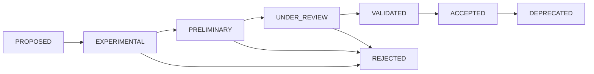

# Rule Lifecycle

## States

`PROPOSED`, `EXPERIMENTAL`, `PRELIMINARY`, `UNDER_REVIEW`, `VALIDATED`, `ACCEPTED`, `DEPRECATED`, `REJECTED`.

## Transitions

A rule may be rejected from `EXPERIMENTAL`, `PRELIMINARY`, or `UNDER_REVIEW` at any point — rejection is not limited to the end of the process.

## Which states may block production workflows

| State | May block generation/export? |
|---|---|
| `PROPOSED` | No |
| `EXPERIMENTAL` | No — experimental rules never gain blocking authority automatically |
| `PRELIMINARY` | **Yes** — this is the current state of all 16 `JM-*` rules; "preliminary" describes confidence in the threshold, not permission to block. A preliminary rule blocks exactly as documented in its `blockingScope`, same as any other rule |
| `UNDER_REVIEW` | Yes, if it was already blocking before review began — entering review does not retroactively suspend existing blocking behavior |
| `VALIDATED` | Yes |
| `ACCEPTED` | Yes |
| `DEPRECATED` | No — a deprecated rule stops evaluating for new documents (see [`108-rule-versioning.md`](108-rule-versioning.md) for historical-document handling) |
| `REJECTED` | No |

**Do not confuse "preliminary" with "non-blocking."** This is a common misreading worth stating explicitly: every one of JewelMind's current 16 jewelry-domain rules is `professionalValidationStatus: preliminary` in the professional-confidence sense, yet several of them (`JM-RING-001`, `JM-BAND-001`, `JM-STONE-001`, etc.) have `severity: ERROR` and genuinely block generation today. Lifecycle state and blocking authority are governed by `blockingScope`/`severity`, not by professional-validation confidence.

## Current lifecycle state of every rule

All 21 registered rules currently carry `lifecycleState: ACCEPTED` in `specs/forge/v1/current-rule-registry.json` — they are running, tested, unconditional parts of the current system, even though 16 of them are only `preliminary` on the professional-validation axis. No rule is currently `PROPOSED`, `EXPERIMENTAL`, `UNDER_REVIEW`, `VALIDATED` (in the professional sense — note this is a different word from the `professionalValidationStatus` field but shares its state name; a rule reaches lifecycle `VALIDATED` once professional review concludes positively, immediately before `ACCEPTED`), `DEPRECATED`, or `REJECTED`.
