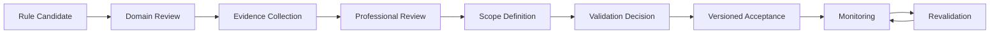

# Professional Validation Lifecycle

This is the Forge-level formalization of the process [`04-jewelry-domain/058-professional-validation-register.md`](../04-jewelry-domain/058-professional-validation-register.md) already established in Sprint 2. **No rule has ever completed this process.**

## Process

## Validation record fields

`ruleId`, exact `ruleVersion` validated, `statementValidated` (the precise claim reviewed, not the whole rule description), `reviewer` identity, `reviewerProfessionalRole`, `reviewerRelevantExperience`, `materialScope`, `manufacturingScope`, `jewelryScope`, `geographicScope` (where applicable), `evidence`, `reviewDate`, `conditions`, `expirationOrReviewTrigger`, `decision`.

## Decisions

`ACCEPTED`, `ACCEPTED_WITH_CONDITIONS`, `REJECTED`, `INSUFFICIENT_EVIDENCE`.

## A validated decision applies to a specific rule version

Per [`108-rule-versioning.md`](108-rule-versioning.md), professional validation is tied to an exact `ruleVersion`. A MAJOR change to a validated rule (changed threshold, severity, or blocking behavior) invalidates that specific validation record — the rule reverts to `preliminary` until re-reviewed at the new version, unless the reviewer explicitly extends their acceptance to the new version in a new record.

## Current state: zero validated rules

Every one of the 21 rules in `specs/forge/v1/current-rule-registry.json` has `professionalValidationStatus` of `preliminary` (the 16 `JM-*` domain rules) or `not_required` (the 5 `FORGE-*` system/structural rules). **No validation record exists in [`forge-rule-provenance-register.md`](../appendices/forge-rule-provenance-register.md) because no professional review has ever taken place.** This is stated here per this Sprint's explicit governing instruction: existing implementation does not itself count as professional validation, and no reviewer is invented to fill this gap.

## Do not invent validators

If a future rule genuinely undergoes professional review, the record must name a real, identifiable reviewer with a stated professional role and relevant experience — never a placeholder name, a generic "industry expert," or an unnamed "jeweler consulted." An incomplete record (missing reviewer name, role, or date) does not confer `validated` status, matching the same discipline [`04-jewelry-domain/058-professional-validation-register.md`](../04-jewelry-domain/058-professional-validation-register.md) already requires.
