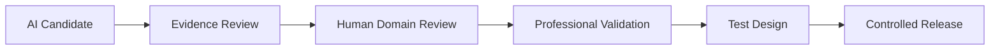

# Future AI-Assisted Rule Discovery

**Status: VISION.** Nothing in this document is implemented. No AI system in this codebase proposes, evaluates, classifies, or influences any jewelry-domain rule today.

## AI may (in a future, unbuilt system)

- Analyze recurring professional feedback for patterns.
- Identify candidate rule patterns from data.
- Suggest possible rule candidates for human review.
- Classify existing documentation for consistency.
- Find inconsistent rules across the codebase (e.g. a threshold documented in one place but not another).
- Draft plain-language explanations of a rule's effect.
- Assist in generating rule test cases for human review.

## AI may never

- Declare a rule professionally valid.
- Modify an active threshold autonomously.
- Deploy a blocking rule without human review.
- Silently change a rule's scope (applicability, severity, or blocking behavior).
- Replace expert validation — see [`103-professional-validation-lifecycle.md`](103-professional-validation-lifecycle.md), which has no AI-authored step in its decision chain.

This is FORGE-GOV-009, restated with the specific workflow below.

## Workflow

Every arrow in this diagram is a human checkpoint. An AI-proposed candidate never skips `Human Domain Review` or `Professional Validation` — it enters the exact same [`103-professional-validation-lifecycle.md`](103-professional-validation-lifecycle.md) process any human-proposed candidate would, at the `PROPOSED` lifecycle state, with `provenanceType: unknown` or a stated basis (e.g. `experimental_observation`) until a human reviewer classifies it further.

## Why this is VISION, not PLANNED

PLANNED implies a concrete near-term intention with a scoped implementation path (per [`00-foundation/000-bible-governance.md`](../00-foundation/000-bible-governance.md)'s classification rule). No AI-assisted rule-discovery tooling has been scoped, designed, or scheduled — it is a long-term possibility recorded here so that, if it is ever built, it is built with these constraints already agreed upon rather than improvised under time pressure.
