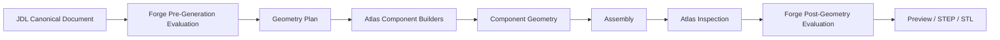
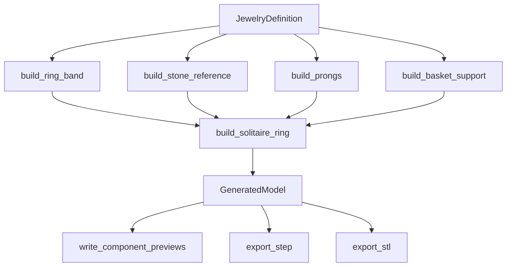

# Atlas Architecture Overview

**Relationship to Alchemist (Sprint 6):** [`08-alchemist/161-compiler-architecture-overview.md`](../08-alchemist/161-compiler-architecture-overview.md)
places this document's pipeline inside the larger five-layer
JDL→Forge→Alchemist→Atlas→Foundry/Vision architecture, and formalizes
the missing link between Forge eligibility and Atlas execution as a
PLANNED `GeometryPlan` object (see
[`08-alchemist/166-geometry-plan-model.md`](../08-alchemist/166-geometry-plan-model.md)).

## Conceptual pipeline

## Current vs. target, stage by stage

| Stage | Target architecture | Current implementation |
|---|---|---|
| JDL Canonical Document | A validated `JewelryDefinition` | CURRENT — `JewelryDefinition.model_validate()` |
| Forge Pre-Generation Evaluation | FORGE-0..FORGE-5 rule evaluation | CURRENT — `validate_definition()`, gated by `has_errors()` |
| Geometry Plan | An explicit, inspectable plan of which components to build with what derived values, produced *before* any CadQuery call | PARTIAL/NOT MATERIALIZED — no such object exists; see [`05-jdl/077-compiler-contract.md`](../05-jdl/077-compiler-contract.md)'s same finding |
| Atlas Component Builders | `build_ring_band`, `build_stone_reference`, `build_prongs`, `build_basket_support` | CURRENT — `backend/jewelmind/geometry/components/*.py` |
| Component Geometry | Four `GeneratedComponent` values | CURRENT |
| Assembly | Fuse or compound-fallback + bounding-box union | CURRENT — `geometry/assemblies/solitaire.py::build_solitaire_ring` |
| Atlas Inspection | A full inspection pass producing `AtlasInspection` facts | PARTIAL — only one runtime check exists (`FORGE-GEOM-001`'s solid-count check); everything else is test-time only, see [`140-geometry-inspection-framework.md`](140-geometry-inspection-framework.md) |
| Forge Post-Geometry Evaluation | Forge interprets Atlas inspection facts as rule violations | NOT IMPLEMENTED — no post-geometry Forge rule exists that consumes an inspection fact today |
| Preview / STEP / STL | Per-component preview STL, fused/compound STEP+STL | CURRENT — `preview/mesh.py`, `exporters/step_exporter.py`, `exporters/stl_exporter.py` |

## Mapping current CadQuery builders into this model

Each of the four `build_*` functions in `geometry/components/*.py` is a self-contained Atlas component builder: it takes the whole `JewelryDefinition` (not just its own JDL subtree — see [`149-current-solitaire-geometry-mapping.md`](149-current-solitaire-geometry-mapping.md) for why some builders read fields outside their own name, e.g. `build_stone_reference` reading `setting.basketHeight`) and returns one `GeneratedComponent`. `build_solitaire_ring` in `geometry/assemblies/solitaire.py` is the current, sole Atlas assembly builder.

## What this document does not claim

It does not claim a `Geometry Plan` object, a full `AtlasInspection` pass, or a `Forge Post-Geometry Evaluation` step exist as separate, addressable stages in running code — each of those is PARTIAL or NOT IMPLEMENTED, stated plainly in the table above, per this Sprint's requirement to distinguish current implementation from target architecture honestly.
