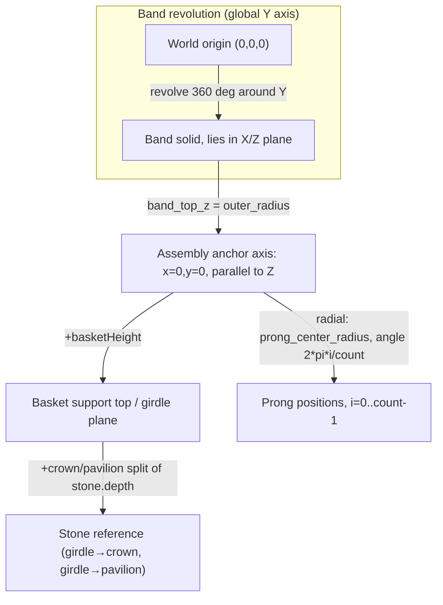

# Coordinate System and Orientation

This is the Bible-level formalization of `docs/geometry-conventions.md`, which remains the detail-level authoritative reference. Every fact below was re-confirmed against the real code during this Sprint, and real numeric vectors are checked into `specs/atlas/v1/test-vectors/coordinate-vectors.json`.

## The convention, exactly

| Concept | Value | Source |
|---|---|---|
| World origin | Center of the ring = center of the finger hole = center of the band's revolution | `docs/geometry-conventions.md`; confirmed in `band.py` (wire drawn at radius from origin, no offset) |
| Finger-hole axis | Global **Y axis** | `band.py::build_ring_band`: `.revolve(360, (0, 0, 0), (0, 1, 0))` |
| Band plane | X/Z plane (when viewed down Y) | Direct consequence of revolving around Y |
| Ring "top" | `(x=0, z=+outer_radius)` | `band_top_z()` in `geometry/constants.py` |
| Assembly anchor axis | The line `x=0, y=0`, parallel to global Z, starting at `z=band_top_z` | Shared by `stone.py`, `prongs.py`, `basket.py` |
| Stone center | `(x=0, y=0)`, girdle plane at `z = band_top_z + setting.basketHeight` | `stone.py::build_stone_reference` |
| Positive Z direction | Away from the band, toward the stone | Consequence of the anchor axis rising in `+Z` |
| Construction plane | Every builder starts from `cq.Workplane("XY")`, then applies a Z offset via `.workplane(offset=...)` | All four component builders |
| Prong angular origin | `prong_0` at local angle 0 → `(x=prong_center_radius, y=0)` | `prongs.py::_prong_positions`: `i=0` gives `cos(0)=1, sin(0)=0` |
| Rotation direction | Increasing prong index `i` increases angle via `2π·i/count`, i.e. mathematically counterclockwise in the local X/Y plane viewed from `+Z` | Direct reading of `math.cos`/`math.sin` usage |

Real values for the default definition (generated by running the code, checked into `specs/atlas/v1/test-vectors/coordinate-vectors.json`): `inner_radius = 8.9`, `outer_radius = 10.700000000000001`, `band_top_z = 10.700000000000001`, `prong_center_radius = 3.085`, `EMBED_MM = 0.4`.

## No inconsistency found

Every builder (`band.py`, `stone.py`, `prongs.py`, `basket.py`) was inspected during this Sprint and found **internally consistent** with the convention above — all four import their Z-reference from the same `geometry/constants.py` functions (`band_top_z`, `EMBED_MM`), and `prongs.py`/`basket.py` additionally share `prong_center_radius` for a matching radial footprint. No file was found to use a different, conflicting coordinate assumption. This is a genuinely clean result, not a gap glossed over — confirmed by direct inspection of all four component files and `geometry/assemblies/solitaire.py` during this Sprint.

## Diagram

