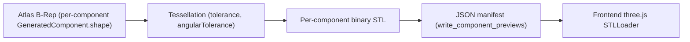

# Preview Mesh Contract

## Pipeline

## Component manifest, exactly

`write_component_previews()` returns, per component: `file` (the STL filename, or `null` if the component has zero solids), `vertexCount`, `triangleCount`, `volumeMm3`, `boundingBox`, `warnings`. Real values for the default definition are in `specs/atlas/v1/test-vectors/component-manifest-vectors.json` (e.g. `band`: 3260 vertices, 5670 triangles).

## Mesh tolerances

Both `preview.meshTolerance` (default 0.1mm) and `preview.angularTolerance` (default 0.2 radians) come directly from the `JewelryDefinition` being previewed — there is no separate, preview-specific default independent of the definition's own values.

## Material-role metadata

**Not currently a distinct manifest field.** The frontend infers material role (metal vs. stone) from the component *name* (`stone_reference` vs. the other three), not from an explicit `geometryRole`/`materialRole` field in the manifest itself — see [`130-component-contract.md`](130-component-contract.md) for the conceptual field this could become.

## Visibility

Every component is always included in the manifest and always visible in the frontend viewer — there is no current per-component visibility toggle beyond what the frontend chooses to render.

## Cache and staleness

Preview files live in `ModelService`'s per-model temp directory, capped at `MAX_CACHED_MODELS = 20` with LRU eviction (see [`05-jdl/083-security-and-resource-limits.md`](../05-jdl/083-security-and-resource-limits.md)). "Stale model" is a **frontend-only** concept (`useProjectStore.ts`'s `isStale` flag) — the backend has no notion of a preview being stale relative to a newer edit; see [`06-forge/107-export-precondition-rules.md`](../06-forge/107-export-precondition-rules.md) for the same gap already documented at the export layer.

## Last-successful-preview behavior

The frontend keeps the last successfully-loaded preview visible if a subsequent generation request fails, rather than clearing the viewport — this is a frontend UX behavior, not an Atlas-level geometry guarantee (Atlas has no concept of "keeping" anything; each generation call is independent).

## Preview must not become an independent geometry implementation

Every preview mesh is tessellated directly from a real `GeneratedComponent.shape` produced by the same builders that produce production geometry — there is no separate, simplified, or approximate geometry construction path used only for preview. This is confirmed by `preview/mesh.py` operating on `model.components.items()` (the exact same objects `_fuse_metal()` and the exporters use), not a parallel construction.
