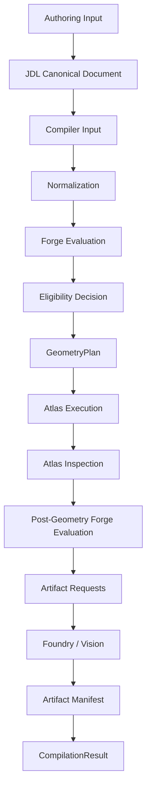

# Compiler Architecture Overview

## Conceptual flow

## Current vs. target, stage by stage

| Conceptual stage | Current implementation |
|---|---|
| Authoring Input → JDL Canonical Document | `JewelryDefinition.model_validate()` (Sprint 3) |
| Compiler Input | PARTIAL — the API layer receives a bare `JewelryDefinition`, not a `CompilationInput` wrapper (see [`163-compilation-input-contract.md`](163-compilation-input-contract.md)) |
| Normalization | CURRENT — Pydantic default-filling, the entire current normalization step (see [`164-normalization-stage.md`](164-normalization-stage.md)) |
| Forge Evaluation | CURRENT — `validate_definition()` |
| Eligibility Decision | CURRENT — `has_errors()` gate in `ModelService.generate()` |
| GeometryPlan | **PLANNED — does not exist** (see [`166-geometry-plan-model.md`](166-geometry-plan-model.md)) |
| Atlas Execution | CURRENT — `build_solitaire_ring()`, but called directly rather than via a `execute_geometry_plan(plan)` interface |
| Atlas Inspection | PARTIAL — one runtime check (fuse solid count); see Sprint 5's [`07-atlas/140-geometry-inspection-framework.md`](../07-atlas/140-geometry-inspection-framework.md) |
| Post-Geometry Forge Evaluation | **NOT IMPLEMENTED** — no Forge rule consumes an Atlas inspection fact today |
| Artifact Requests | PARTIAL — four separate HTTP endpoints, not a unified request list (see [`177-artifact-request-model.md`](177-artifact-request-model.md)) |
| Foundry / Vision | CURRENT, but not yet named as separate layers — `exporters/*.py` (Foundry-to-be, formalized Sprint 7) and `preview/mesh.py` + the frontend viewer (Vision-to-be) |
| Artifact Manifest | PARTIAL — `preview_manifest` exists for previews only; no manifest aggregates STEP/STL/JSON/specification results |
| CompilationResult | PARTIAL — `GenerateResponse`/`ModelMetadataResponse` cover much of this conceptually, but no single object matches the full shape (see [`171-compilation-result-model.md`](171-compilation-result-model.md)) |

## Why this Sprint does not build a GeometryPlan class

Per this Sprint's explicit scope: the specification is defined so a future implementation has a target, not so one is built now. The current inline approach (`build_solitaire_ring()` computing and immediately consuming derived values) works correctly and passes every test — introducing a `GeometryPlan` object without a demonstrated need would be exactly the kind of premature abstraction CLAUDE.md warns against.
