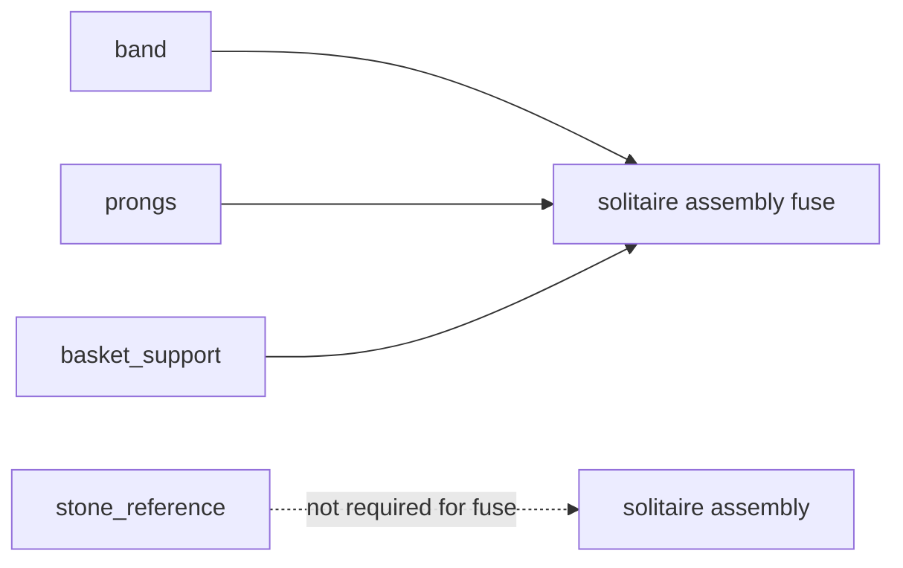

# Component Build Order

Real dependency structure, confirmed by inspecting `geometry/assemblies/solitaire.py` and `geometry/components/*.py` directly during this Sprint — checked into `specs/alchemist/v1/test-vectors/build-order-vectors.json`.

## True data dependencies

Only the assembly/fuse step has real data dependencies, and only on three of the four components:

## No true dependency among the four component builders

`band`, `stone_reference`, `prongs`, and `basket_support` have **zero data dependency on each other's build output**. Each independently calls the same shared pure functions (`geometry/constants.py::band_top_z()`, `prong_center_radius()`) with the *definition* as input — never with another component's actual `GeneratedComponent`/shape as input. `stone_reference` in particular is not an input to the fuse step at all (only `band`, `prongs`, `basket_support` are).

## Independent components

All four could, in principle, be constructed in parallel or in any order — nothing in their construction logic requires a specific sequence. The assembly step is the only true synchronization point, and it requires exactly three of the four (not `stone_reference`).

## Current code's call order is incidental, not dependency-derived

`build_solitaire_ring()` calls them in the fixed order `band, stone_reference, prongs, basket_support` — this is how the function happened to be written, not the result of a topological sort. This document states that explicitly so a future reader does not mistake list position for a real constraint (per this Sprint's explicit instruction: "Build order must be derived from explicit dependencies, not merely list position").

## Failure propagation

If `band` construction fails (an unhandled exception, never observed in practice), the exception propagates immediately — `stone_reference`, `prongs`, and `basket_support` are never even attempted, since `build_solitaire_ring()`'s four calls are sequential Python statements, not independently-scheduled parallel tasks. This means a failure early in the current fixed call order (band) "wastes" less work than a failure late in it (basket_support, after three successful builds) — an incidental property of the current sequential implementation, not a deliberate ordering optimization.
