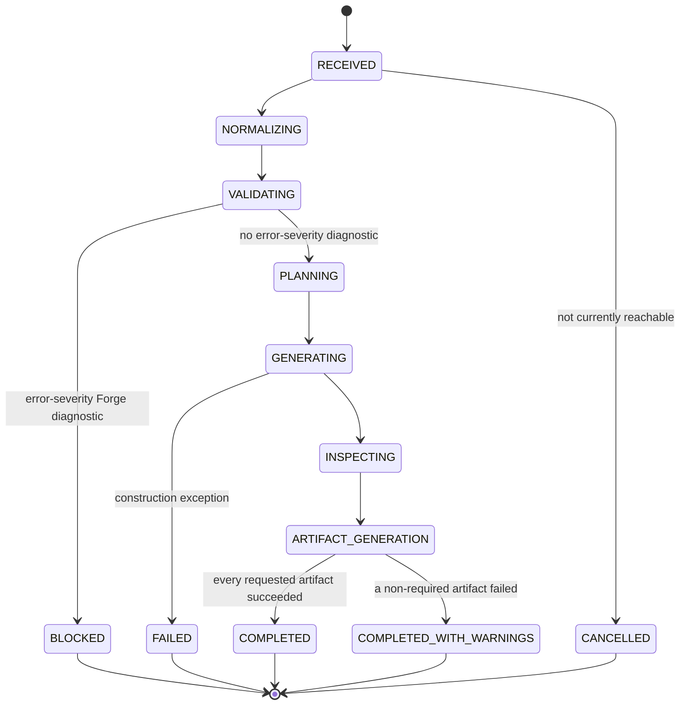

# Compilation State Machine

**No explicit state machine exists in current code.** The real implementation moves through these conceptual states implicitly, as a linear sequence of function calls and exceptions, never as named enum values stored anywhere.

## States

`RECEIVED`, `NORMALIZING`, `VALIDATING`, `BLOCKED`, `PLANNING`, `GENERATING`, `INSPECTING`, `ARTIFACT_GENERATION`, `COMPLETED`, `COMPLETED_WITH_WARNINGS`, `FAILED`, `CANCELLED`.

## Valid transitions

## Terminal states

`COMPLETED`, `COMPLETED_WITH_WARNINGS`, `FAILED`, `BLOCKED`, `CANCELLED`.

## Mapping to current real behavior

| State | Current equivalent |
|---|---|
| `RECEIVED` | The HTTP request body has arrived at `api/routes.py::generate_model()` |
| `NORMALIZING` | FastAPI/Pydantic parsing `JewelryDefinition` |
| `VALIDATING` | `validate_definition()` |
| `BLOCKED` | `ValidationBlockedError` raised, HTTP 422 |
| `PLANNING` | **Skipped** — no distinct planning stage exists; this state is never actually entered as a separate step |
| `GENERATING` | `build_solitaire_ring()` running |
| `INSPECTING` | Implicit — volumes/bounding boxes computed as part of `GENERATING`, not a separate step |
| `ARTIFACT_GENERATION` | Currently split: preview generation happens inline inside the same call as `GENERATING` (see [`173-partial-compilation-policy.md`](173-partial-compilation-policy.md)); STEP/STL/JSON/specification generation happens later, per separate HTTP call |
| `COMPLETED` | A `GenerateResponse` returned with HTTP 200, or a later export succeeding |
| `COMPLETED_WITH_WARNINGS` | **No distinct current status** — a generation with non-empty `warnings` still just returns `GenerateResponse` (HTTP 200); the caller must inspect `warnings` themselves to notice |
| `FAILED` | `ModelGenerationFailedError`/`StepExportFailedError`/`StlExportFailedError`, HTTP 500 |
| `CANCELLED` | **Not reachable at all** — no cancellation mechanism exists anywhere in the current backend |

## Partial artifact generation and state

See [`173-partial-compilation-policy.md`](173-partial-compilation-policy.md) for exactly when `COMPLETED_WITH_WARNINGS` should conceptually apply vs. `FAILED` — this document only defines the state shape, not the policy for choosing between terminal states.
