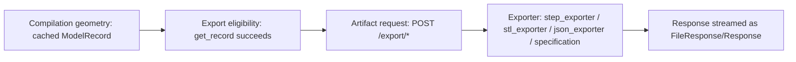

# Export Generation Integration

## Flow

There is no distinct "artifact validation" step between the exporter writing a file and the response being streamed — the exporter either successfully writes a real file (which is then streamed) or raises (caught and converted to an `AppError`).

## Mapping per artifact

| Artifact | Exporter | Production-component inclusion |
|---|---|---|
| STEP | `exporters/step_exporter.py::export_step()` | `combined_metal` always; `stone_reference` opt-in via `includeStoneReference` |
| STL | `exporters/stl_exporter.py::export_stl()` | Same |
| JSON | `exporters/json_exporter.py::export_json()` | N/A — exports the definition itself, not geometry |
| Technical specification | `exporters/specification.py::build_specification()` | N/A — a text summary referencing definition + `GeneratedModel` metadata, not a geometry file |

## Export eligibility, exactly

`ModelService.get_record(model_id)` — the sole eligibility check. If it succeeds, export proceeds; there is no additional, distinct "is this model eligible for export" check beyond "does a cached record exist" (which itself implies the model already passed Forge validation and Atlas construction at generation time).

## No artifact validation step

Confirmed: no code re-checks the exported file for correctness (e.g. re-importing the STEP file, re-parsing the STL) after writing it — the exporter's own success (no exception raised) is treated as sufficient. See [`187-alchemist-gap-analysis.md`](187-alchemist-gap-analysis.md) for this recorded as a gap (`ALCHEMIST-GAP`-adjacent to Sprint 5's `ATLAS-GAP-014`/`ATLAS-GAP-015`).
