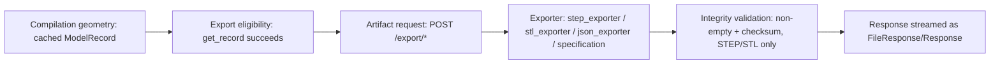

# Export Generation Integration

## Flow

As of Sprint 7, STEP and STL exports pass through a real, distinct integrity-validation step (`validate_non_empty()` + `sha256_checksum()`, both in `exporters/integrity.py`) between the exporter writing a file and the response being streamed — see [`09-foundry/203-export-validation-pipeline.md`](../09-foundry/203-export-validation-pipeline.md). JSON and the technical specification still have no such step.

## Mapping per artifact

| Artifact | Exporter | Production-component inclusion |
|---|---|---|
| STEP | `exporters/step_exporter.py::export_step()` | `combined_metal` always; `stone_reference` opt-in via `includeStoneReference` |
| STL | `exporters/stl_exporter.py::export_stl()` | Same |
| JSON | `exporters/json_exporter.py::export_json()` | N/A — exports the definition itself, not geometry |
| Technical specification | `exporters/specification.py::build_specification()` | N/A — a text summary referencing definition + `GeneratedModel` metadata, not a geometry file |

## Export eligibility, exactly

`ModelService.get_record(model_id)` — the sole eligibility check. If it succeeds, export proceeds; there is no additional, distinct "is this model eligible for export" check beyond "does a cached record exist" (which itself implies the model already passed Forge validation and Atlas construction at generation time).

## Artifact validation step, updated for Sprint 7

Partially superseded: as of Sprint 7, `validate_non_empty()` runs for every real STEP/STL export (rejecting a missing or empty file), and `sha256_checksum()` is always computed and returned via the `X-Content-SHA256` response header. What remains true, and is now stated precisely rather than as a blanket "no validation": no code re-*imports* or re-*parses* the exported file to confirm its internal structure at request time — that deeper check (re-importing the STEP file, parsing the STL binary header) exists only in the test suite, never for a real user's request. See [`09-foundry/202-artifact-integrity-model.md`](../09-foundry/202-artifact-integrity-model.md) for the exact 8-level breakdown of what runs when, and [`187-alchemist-gap-analysis.md`](187-alchemist-gap-analysis.md) for the now-partially-closed gap.
