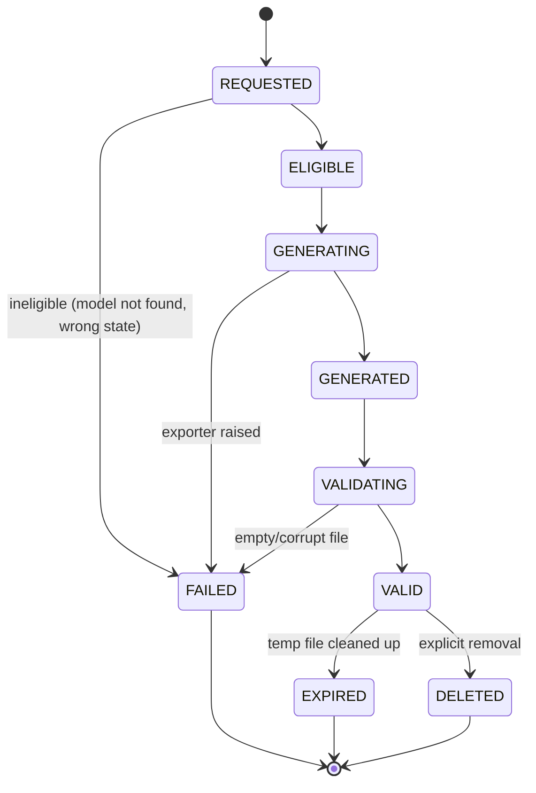

# Artifact Domain Model

## Artifact categories

| Category | Meaning | Current members |
|---|---|---|
| `PRODUCTION_ARTIFACT` | Intended to inform or feed physical manufacturing | STEP, STL |
| `TECHNICAL_ARTIFACT` | Human-readable technical documentation of the design | Technical specification (Markdown) |
| `DESIGN_DEFINITION_ARTIFACT` | The canonical, re-loadable design intent itself | Canonical JDL JSON |
| `PREVIEW_ARTIFACT` | Renders/tessellations for on-screen display only, never manufacturing | Per-component preview STL (see [`08-alchemist/179-preview-generation-integration.md`](../08-alchemist/179-preview-generation-integration.md)); owned jointly with the future Vision layer |
| `METADATA_ARTIFACT` | Data *about* an artifact, not an artifact itself | Checksums, artifact records, manifests (all PLANNED as structured objects; the checksum value itself is CURRENT) |

A `PRODUCTION_ARTIFACT` label is a statement about *intent*, not a manufacturing-readiness guarantee — FOUNDRY-GOV-005 still requires every one of them to carry the professional-review disclaimer somewhere in its accompanying documentation.

## Artifact lifecycle states (conceptual)

**No code today models this state machine explicitly.** The real system's implicit state machine is much shorter: a request either raises an exception (`MODEL_NOT_FOUND`, `STEP_EXPORT_FAILED`, `STL_EXPORT_FAILED`, `FOUNDRY_INTEGRITY_FAILED`) or returns a `FileResponse` with the file already generated, validated non-empty, checksummed, and about to be streamed. There is no observable `GENERATING` or `VALIDATING` state a caller can poll — the HTTP request blocks until the artifact is `VALID` or the request fails. `EXPIRED`/`DELETED` are real in the sense that the temp file is deleted after the response streams (see [`207-temp-file-lifecycle.md`](207-temp-file-lifecycle.md)), but no `ArtifactRecord` persists afterward to actually transition into those states — there is nothing left to expire or delete a record for.

## Relationship to Alchemist's artifact vocabulary

Sprint 6 already defined a minimal `ArtifactRequest`/`ArtifactManifest` pair in `specs/alchemist/v1/`, scoped to 4 artifact types across export *and* preview. Foundry's `specs/foundry/v1/artifact-request.schema.json` and `artifact-record.schema.json` are a genuine superset for production/technical artifacts specifically — richer integrity/checksum/versioning fields Alchemist's schema does not carry — not a duplicate. `PREVIEW_MESH` remains Alchemist/Vision's concern, not Foundry's; see [`193-artifact-request-contract.md`](193-artifact-request-contract.md) for the exact reconciliation.
