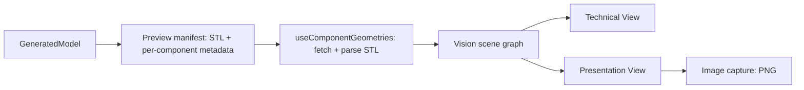

# Vision Architecture Overview

## Conceptual flow

Both E and F read from the same `D` — the same parsed `THREE.BufferGeometry` objects, the same `componentVisibility` state, the same component identity. Only the material parameters, lighting rig, background, and camera defaults differ between them.

## Two decoupled state stores

| Store | Owns | Never does |
|---|---|---|
| `useProjectStore` (pre-existing, unchanged) | `currentDefinition`, `generatedModel`, `lastSuccessfulPreview`, `isStale`, `generationStatus` | Never reads Vision presentation state |
| `useVisionStore` (new, Sprint 8) | `viewMode`, `componentVisibility`, `selectedComponent`, `showGrid`, `showAxes` | Never imports `useProjectStore`; never calls `generate()`/`updateXxx()` |

This split is what makes VISION-GOV-014 ("presentation styling must remain downstream from geometry") structurally true rather than merely a convention — `useVisionStore.ts` has zero import of `useProjectStore`, confirmed by direct inspection, and `frontend/src/store/useVisionStore.test.ts::'switching view mode never touches project/geometry state'` asserts it at runtime too.

## Where Vision code lives

`frontend/src/vision/` (`types.ts`, `materials.ts`, `camera.ts`, `filename.ts`, `capture.ts` — all pure, WebGL-free logic), `frontend/src/store/useVisionStore.ts`, and the viewer components: `ModelViewport.tsx` (orchestrator), `ViewModeSwitch.tsx`, `ViewportToolbar.tsx`, `ComponentVisibilityPanel.tsx`, `PresentationPanel.tsx`, `ComponentMesh.tsx`. See [`246-current-viewer-code-mapping.md`](246-current-viewer-code-mapping.md) for a full classification.

## What changed vs. what was preserved

**Preserved unchanged**: `useComponentGeometries.ts` (STL fetch/parse/dispose), `useProjectStore.ts`'s generation/stale/last-good logic, the backend preview-generation pipeline's STL output. **Changed**: `ModelViewport.tsx` was substantially rewritten to add view-mode-aware rendering; `ComponentMesh.tsx` was extended from `meshStandardMaterial` to `meshPhysicalMaterial` to support the stone's transmissive presentation look; `ViewportToolbar.tsx` and `ComponentVisibilityPanel.tsx` gained new controls. **Added**: everything under `frontend/src/vision/`, `useVisionStore.ts`, `ViewModeSwitch.tsx`, `PresentationPanel.tsx`. **Backend**: one small, additive metadata extension to the preview manifest (`geometryRole`, `productionRole`, `meshSource`, `generationStatus` per component) — see [`223-atlas-to-vision-contract.md`](223-atlas-to-vision-contract.md).
