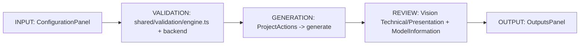

# Product Workspace Overview

## The ten workflow capabilities, mapped to real UI

| Capability | Real implementation |
|---|---|
| 1. Create/configure a design | `ConfigurationPanel` (design parameters) + the Advanced disclosure |
| 2. Understand its current state | `ModelStatusBadge` in the header, computed by `computeModelState()` |
| 3. Edit parameters | `NumericField`/`SelectField`, each wired to a `useProjectStore.updateXxx()` action |
| 4. Receive immediate validation feedback | `shared/validation/engine.ts`, re-run on every edit, shown in the Validation tab |
| 5. Generate deterministic geometry | `ProjectActions`'s single primary button → `useProjectStore.generate()` |
| 6. Inspect the result technically | Technical View (Vision, Sprint 8) + `Model info` tab |
| 7. Inspect it visually | Presentation View (Vision, Sprint 8) |
| 8. Understand warnings | Validation tab, severity-ordered |
| 9. Regenerate after changes | Same primary button, relabeled "Regenerate model"; stale state shown until then |
| 10. Export required artifacts | `OutputsPanel` (new this Sprint), gated by `computeOutputEligibility()` |
| 11. See which model version the outputs refer to | Every output is gated on the same `isStale` flag the model-status badge reads — an output can never be requested for a model the badge doesn't also call current |

## INPUT → VALIDATION → GENERATION → REVIEW → OUTPUT

This is the conceptual pipeline the whole workspace communicates, restated as the real data flow:

No new architectural layer was introduced to represent this pipeline — it is the existing JDL→Forge→Alchemist→Atlas→Vision/Foundry pipeline, viewed from the Studio/UX side. Studio's job this Sprint was making that pipeline visibly legible, not building a new one.

## What "coherent" means, concretely, for this Sprint

Before this Sprint: 3 different places to trigger an export, no single place answering "is my model current," and a parameter list with no distinction between what most users need to touch and what only matters for exact technical replication. After this Sprint: one status indicator, one Outputs area, one generation action, and a parameter editor split into Design and Advanced groups — see [`282-current-ui-code-mapping.md`](282-current-ui-code-mapping.md) for the itemized before/after.
