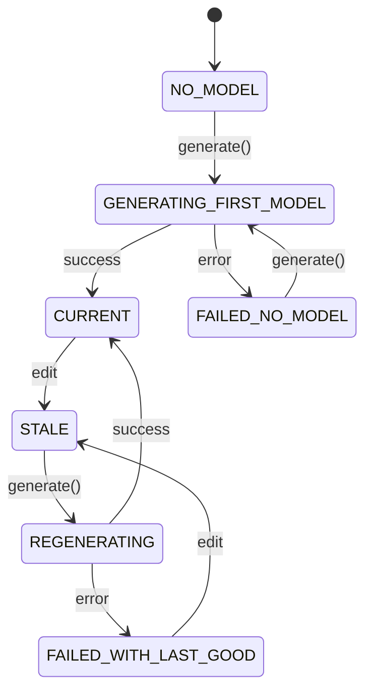

# Model State Experience

## The 7 states, exactly as implemented

`frontend/src/studio/modelState.ts::computeModelState()` — a pure function, unit-tested (9 tests), consuming only `generationStatus`, `hasLastGoodPreview`, and `isStale` from `useProjectStore`:

| State | Label shown | Detail shown |
|---|---|---|
| `NO_MODEL` | No model yet | Configure your design and generate a model to begin. |
| `GENERATING_FIRST_MODEL` | Generating… | Building the first model for this design. |
| `CURRENT` | Current model | This preview matches your current parameters. |
| `STALE` | Design changed | Parameters changed since this model was generated — regenerate to update it. |
| `REGENERATING` | Regenerating… | Your last successful model remains visible while this completes. |
| `FAILED_NO_MODEL` | Generation failed | No model is available yet. Check the parameters and try again. |
| `FAILED_WITH_LAST_GOOD` | Regeneration failed | The last successful model is still shown below. Check the parameters and try again. |

## One precedence rule worth naming explicitly

A new parameter edit always supersedes a stale reading of a past failure: if the last `generate()` call failed and the user then edits another parameter, the state becomes `STALE`, not `FAILED_WITH_LAST_GOOD` — because the failure was for parameters that no longer describe the current design. `modelState.test.ts::'prefers STALE over FAILED_WITH_LAST_GOOD once the user edits again after a failure'` locks this in.

## Consumed identically by 3 real UI surfaces

1. `AppHeader.tsx` → `ModelStatusBadge` — the permanent, header-level indicator.
2. `ModelViewport.tsx` → an in-viewport banner, shown only for `STALE`/`FAILED_WITH_LAST_GOOD` (the two states where a visible model needs the user's attention), using the exact same `describeModelState()` label — never a separately-worded duplicate.
3. `OutputsPanel.tsx` → indirectly, via `computeOutputEligibility()`'s `isStale` input.

## Never color alone

Every state renders a text label plus a plain-language detail sentence (`ModelStatusBadge`) — restating STUDIO-GOV-005/009. The `tone` (neutral/success/warning/error/progress) only changes the badge's border/background color, never the sole signal.

## Machine-readable schema

`specs/studio/v1/generation-state.schema.json` mirrors this exact 7-value enum plus the label/detail pair, validated against 2 real examples (`generated-current-model.json`, `generated-stale-model.json`, plus a failure case) in `specs/studio/v1/examples/`.
