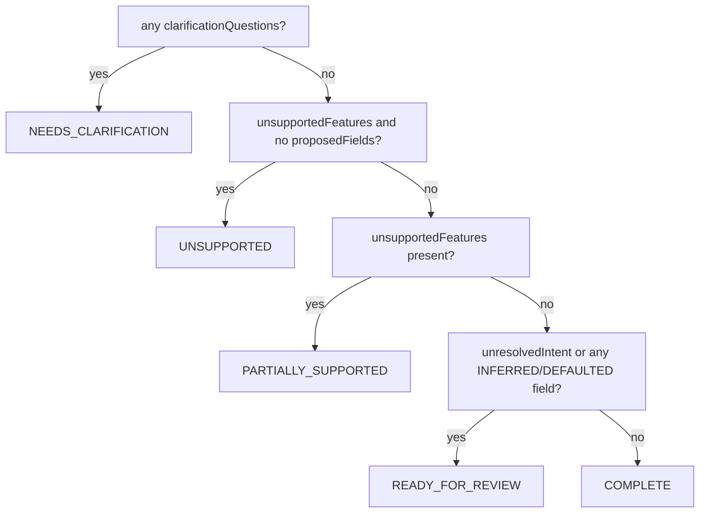

# Design Proposal Model

## `DesignerProposal`, field by field

`backend/jewelmind/designer/schemas.py::DesignerProposal`:

| Field | Type | Meaning |
|---|---|---|
| `proposalId` | `str` | `f"proposal-{uuid.uuid4()}"` — generated fresh per request, never reused or persisted. |
| `sourceText` | `str` | The original `request.text`, echoed back for the "You asked" review section. |
| `interactionMode` | `"CREATE" \| "MODIFY"` | Copied from the request. |
| `unresolvedIntent` | `list[str]` | Non-mappable descriptive text — see [`293-intent-extraction-model.md`](293-intent-extraction-model.md). |
| `unsupportedFeatures` | `list[UnsupportedFeature]` | See [`301-unsupported-request-handling.md`](301-unsupported-request-handling.md). |
| `proposedFields` | `list[ProposedField]` | Successfully extracted, capability-checked, normalized field values. |
| `clarificationQuestions` | `list[ClarificationQuestion]` | See [`300-clarification-policy.md`](300-clarification-policy.md). |
| `diagnostics` | `list[DesignerDiagnostic]` | See [`312-designer-error-model.md`](312-designer-error-model.md). |
| `candidateJDL` | `JewelryDefinition \| None` | `None` only when the patch failed Pydantic validation. |
| `validation` | `list[ValidationResult]` | The real Forge result for `candidateJDL`. |
| `forgeEvaluation` | `ForgeEvaluationSummary \| None` | `{results, hasErrors}` — mirrors `validation` for convenience. |
| `diff` | `list[FieldDiff]` | See [`311-proposal-diff-model.md`](311-proposal-diff-model.md). |
| `proposalStatus` | `ProposalStatus` | The 8-value lifecycle below. |

## The 8-value `proposalStatus` lifecycle

`service.py::_resolve_status()` — evaluated in this exact order, first match wins:

`INVALID` is set separately, before this function even runs, when `_apply_patch()` returns `None` — i.e. the accepted patch could not form a valid `JewelryDefinition` at all. `ACCEPTED` and `REJECTED` are never returned by the backend: they exist in the `ProposalStatus` enum purely as frontend-local states a future UI *could* track after a user decision, but today's `DesignerPanel.tsx` doesn't persist a decision anywhere — applying or cancelling just clears the local review state.

## Backend-vs-frontend status split

| Status | Set by |
|---|---|
| `COMPLETE`, `NEEDS_CLARIFICATION`, `PARTIALLY_SUPPORTED`, `UNSUPPORTED`, `INVALID`, `READY_FOR_REVIEW` | Backend, every request |
| `ACCEPTED`, `REJECTED` | Never set anywhere in this codebase today |

## `DesignerResult`

The outermost response shape is just `{requestId, proposal}` — `requestId` echoes the request for correlation, and `proposal` is the object above.

See [`295-designer-to-jdl-contract.md`](295-designer-to-jdl-contract.md) for the rules governing `candidateJDL`'s construction.
