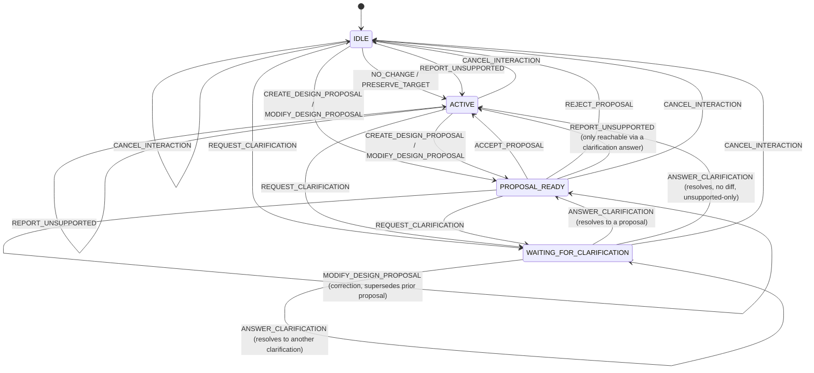

# Conversation State Machine

`specs/conversation/v1/conversation-state.schema.json` cites this document for "the full Mermaid diagram." Every edge below is grounded in a real branch of `actions.py::classify_action()` and `service.py::process_turn()`/its `_handle_*` methods — no edge here is a code path that doesn't exist.

## Diagram

## Grounding each edge group

**Entry.** `state.new_session()` always starts at `IDLE`.

**No-op / preserve.** `classify_action()` returns `NO_CHANGE` only when nothing is pending and the text matches `_NOOP_PHRASES`; `PRESERVE_TARGET` is decided inside `_handle_designer_routed()` (not `classify_action()` itself — a short message matching `find_preserve_target()` short-circuits before Designer is ever called). Neither handler touches `session.status`, so it stays whatever it already was — shown above as `IDLE`/`ACTIVE` self-loops because those are the only two statuses these actions are ever classified from in practice (`classify_action()` only reaches the `NO_CHANGE`/`PRESERVE_TARGET` branches when there is no pending clarification and no active proposal, i.e. the session is already `IDLE` or `ACTIVE`).

**Creating a proposal.** `_resolve_designer_proposal()` sets `session.status = "PROPOSAL_READY"` whenever Designer returns a proposal with proposed fields or intent statements (as opposed to a clarification question or an unsupported-only result).

**Clarification opened.** Two distinct call sites open a clarification: `_handle_designer_routed()`'s ambiguous-reference branch, and `_resolve_designer_proposal()`'s `proposal.clarificationQuestions` branch (reachable from a fresh `MODIFY_DESIGN_PROPOSAL`/`CREATE_DESIGN_PROPOSAL` turn, or from a correction turn while a proposal was already `PROPOSAL_READY` — hence the third incoming edge from `PROPOSAL_READY`).

**Answering a clarification.** `_handle_answer_clarification()`: an answer that fails `clarifications.try_resolve_answer()` returns early with the session's status untouched (still `WAITING_FOR_CLARIFICATION`, still the same open thread — CONV-GOV-007). An accepted answer clears `pendingClarification`, calls Designer with `combined_text`, and routes through `_resolve_designer_proposal()` exactly like any other Designer-routed turn — so it can land on `PROPOSAL_READY` (a real diff or intent statements), stay in `WAITING_FOR_CLARIFICATION` (Designer itself asks a *further* question), or reach `ACTIVE` (Designer reports the feature unsupported with no proposed fields, via `REPORT_UNSUPPORTED`'s `session.status = "ACTIVE"`).

**Accept / reject / correction.** `_handle_accept()` sets `ACTIVE`; `_handle_reject()` sets `IDLE`. A correction (any substantive text while `session.activeProposal.status == "ACTIVE"` that isn't an accept/reject phrase) classifies as `MODIFY_DESIGN_PROPOSAL` and is handled by `_handle_designer_routed()`, which supersedes the old proposal (`status: "SUPERSEDED"`) and — assuming Designer returns another real proposal — sets `session.status = "PROPOSAL_READY"` again, hence the `PROPOSAL_READY --> PROPOSAL_READY` self-loop. See [`383-correction-model.md`](383-correction-model.md).

**Cancel.** `_handle_cancel()` unconditionally sets `session.status = "IDLE"` regardless of the state it was called from — the diagram's four incoming edges into `IDLE` from `CANCEL_INTERACTION` are all the same one function. `classify_action()`'s `_UNDO_MARKERS` check runs before every other branch, including the `has_clarification` check, so `CANCEL_INTERACTION` can fire from any state, including `WAITING_FOR_CLARIFICATION`.

## Cross-reference to real observed data

`specs/conversation/v1/test-vectors/state-transition-vectors.json` (documented in full in [`373-conversation-session-lifecycle.md`](373-conversation-session-lifecycle.md)) independently confirms three of the edges above by having actually run them: `IDLE -> PROPOSAL_READY` (`MODIFY_DESIGN_PROPOSAL`), `PROPOSAL_READY -> ACTIVE` (`ACCEPT_PROPOSAL`), `PROPOSAL_READY -> IDLE` (`REJECT_PROPOSAL`), `IDLE -> WAITING_FOR_CLARIFICATION` (`REQUEST_CLARIFICATION`), and `WAITING_FOR_CLARIFICATION -> WAITING_FOR_CLARIFICATION` (`ANSWER_CLARIFICATION`, invalid answer). `backend/tests/test_conversation_engine.py::TestRejectAndCancel::test_cancel_clears_pending_clarification` independently exercises `WAITING_FOR_CLARIFICATION -> IDLE` via `CANCEL_INTERACTION`.
