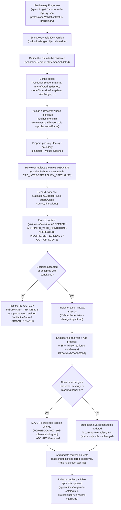

# Rule Validation Process

This document defines the process for taking one preliminary Forge rule from
`specs/forge/v1/current-rule-registry.json` through a professional review and
producing a real `ValidationRecord` (or an honest non-validation outcome).
It does not itself perform a review — the active registry
(`specs/professional-validation/v1/current-validation-registry.json`)
contains zero records today, and nothing in this document changes that.

## Process flow



## Review the rule's meaning, not its Python

A professional reviewer evaluates the **claim a rule makes about jewelry
practice** — e.g. "does requiring six prongs for stones larger than 8 mm
match real bench practice for this stone size and setting style" — not the
Python that implements it. Handing a `GOLDSMITH_BENCH_JEWELER` a diff of
`backend/jewelmind/validation/engine.py` is not a valid review method for
that role; `ReviewerQualification.role` (`413-reviewer-role-model.md`)
gates what a reviewer is being asked to judge.

The one exception is `CAD_INTEROPERABILITY_SPECIALIST`: that role's
`professionalFocus` can legitimately include implementation-level review
(e.g. whether a rule's threshold is actually reachable given the schema's
own numeric constraints, or whether the rule's `stage`/`blockingScope` in
`specs/forge/v1/current-rule-registry.json` is correctly declared) — because
that is a CAD-software-workflow judgment, not a jewelry-craft judgment.

## Preparing examples: a worked case, JM-PRONG-003

`JM-PRONG-003` (`backend/jewelmind/validation/rules.py::PRONG_COUNT_VS_STONE_SIZE`,
implemented in `backend/jewelmind/validation/engine.py::_prong_rules`) is a
concrete, verifiable example of what "prepare passing / failing / boundary
cases" means in practice. Reading the real code:

```python
if d.stone.diameter > 8 and d.setting.prongCount == 4:
    out.append(R.ValidationResult(
        ruleId=R.PRONG_COUNT_VS_STONE_SIZE,
        severity="warning",
        message="Stones larger than 8 mm are typically more secure with six prongs.",
        parameter="setting.prongCount",
        suggestedValue=6,
    ))
```

Its real, current behavior — worth stating precisely because it is easy to
mischaracterize — is a **non-blocking `warning`**, not an error: `has_errors()`
(`validation/engine.py`) only counts `severity == "error"`, so a 4-prong,
9 mm-stone definition still generates and exports successfully; it is
merely flagged. A reviewer preparing this case set should record:

| Case | `stone.diameter` | `setting.prongCount` | Real current outcome |
|---|---|---|---|
| Passing (below threshold) | 7.9 mm | 4 | No `JM-PRONG-003` result at all |
| Failing (above threshold) | 8.1 mm | 4 | `JM-PRONG-003` warning fires, generation still succeeds |
| Exact boundary | 8.0 mm | 4 | Condition is `> 8`, so 8.0 mm exactly does **not** trigger the rule — a reviewer should explicitly confirm whether the boundary should be inclusive |
| Never triggers | any diameter | 6 | The `prongCount == 4` condition is never met; `JM-PRONG-003` cannot fire regardless of stone size |

The reviewer's claim under review (`ValidationDecision.statementValidated`)
should therefore be phrased narrowly and accurately, e.g.: *"A 4-prong
setting for stones above 8.0 mm diameter warrants at minimum a
non-blocking warning recommending 6 prongs, for round stones under lost-wax
casting"* — scoped via `ValidationScope.stoneShape="round"`,
`manufacturingMethod="lost_wax_casting"`. It should not be phrased as "4
prongs are blocked above 8 mm," because that is not what the implementation
currently does; a reviewer might separately recommend that severity be
raised to `error`, but that recommendation is itself a proposed Forge
rule-version change (see the flow above), not a description of current
behavior.

## Cross-references

- [`412-validation-object-model.md`](412-validation-object-model.md) — `ValidationTarget`/`ValidationDecision` field definitions.
- [`415-validation-scope-model.md`](415-validation-scope-model.md) — how `ValidationScope` narrows a claim.
- [`434-implementation-change-impact.md`](434-implementation-change-impact.md), [`435-validation-to-forge-workflow.md`](435-validation-to-forge-workflow.md) — what happens after acceptance.
- [`443-current-preliminary-rule-review-plan.md`](443-current-preliminary-rule-review-plan.md) — the concrete plan for reviewing all 16 preliminary jewelry-domain rules.
- [`06-forge/108-rule-versioning.md`](../06-forge/108-rule-versioning.md) — MAJOR/MINOR rule-version semantics.
