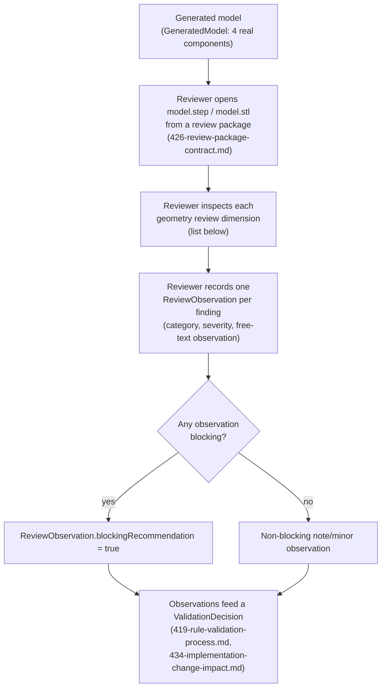

# Geometry Validation Process

This document scopes what a `JEWELRY_CAD_DESIGNER` or `GOLDSMITH_BENCH_JEWELER`
reviewer looks at when reviewing JewelMind's **generated geometry itself**
(as distinct from a Forge rule's threshold — see
[`419-rule-validation-process.md`](419-rule-validation-process.md) — or
manufacturing suitability — see
[`421-manufacturing-validation-process.md`](421-manufacturing-validation-process.md)).

## Process flow

## No invented numeric thresholds

JewelMind does not define a pass/fail numeric score for any of the
dimensions below. A `ReviewObservation`
(`backend/jewelmind/professional_validation/schemas.py`) carries a
`category` (free-text, e.g. `"basket_geometry"`), a `severity`
(`FindingSeverity`: `NOTE | MINOR | MODERATE | MAJOR | CRITICAL`), and a
free-text `observation` field — never a score compared against a threshold
JewelMind itself invented. A reviewer supplies professional judgment in
prose; the schema exists to make that judgment structured and auditable,
not to quantify it artificially.

## Geometry review dimensions

A reviewer evaluating a generated solitaire model is expected to consider:

- **Overall construction logic** — does the assembly hang together as a
  coherent ring, independent of any one component's detail.
- **Component placement** — are band, basket, prongs, and stone reference
  positioned relative to one another the way a real design would be.
- **Band geometry** — cross-section, profile (`comfort_fit`/`flat`),
  proportions.
- **Basket geometry** — see [`422-setting-validation-process.md`](422-setting-validation-process.md)
  for the current, simplified implementation.
- **Prong geometry** — see the same document.
- **Component connectivity** — do components actually overlap/fuse in 3D
  (the codebase's `EMBED_MM` embedding constant exists specifically so
  components genuinely intersect rather than merely touch at a surface —
  see `backend/jewelmind/geometry/constants.py`), or are there gaps.
- **Stone relationship** — how the stone reference solid sits relative to
  the prongs/basket (never fused to metal — LAW-006, ATLAS-GOV-007).
- **Seat/bearing absence or presence** — whether a girdle seat or bearing
  cut exists in the current metal geometry at all. See
  [`422-setting-validation-process.md`](422-setting-validation-process.md)
  for the verified answer.
- **Setting accessibility** — whether the current geometry would allow a
  stone to actually be set by hand, given the modeled prong/basket shapes.
- **Plausibility for intended workflow** — whether this could plausibly
  serve as a starting point for further professional CAD work versus
  needing to be rebuilt from scratch.
- **Model editability** — after import into another CAD tool (see
  [`424-cad-workflow-validation-process.md`](424-cad-workflow-validation-process.md)),
  whether the solids are usable primitives to edit further.
- **Unexpected surfaces or bodies** — any solid, face, or artifact that
  should not be there (e.g. a boolean-fuse fallback compound — see
  `docs/bible/appendices/atlas-fallback-register.md`).
- **Overbuilt or underbuilt areas** — metal that is implausibly thick/thin
  relative to what the reviewer would expect for the stated dimensions.
- **CAD cleanliness** — solid validity, absence of self-intersections or
  degenerate geometry, useful naming/grouping once imported.

## The real component list a reviewer sees

`GeneratedModel.components` (`backend/jewelmind/geometry/model.py`) is a
`dict[str, GeneratedComponent]`. Reading the actual builders
(`backend/jewelmind/geometry/components/*.py` and
`backend/jewelmind/geometry/assemblies/solitaire.py`), the solitaire
assembly produces exactly four named components, every one of which
appears in every manifest regardless of whether it has zero geometry
(ATLAS-GOV-006):

| Component name | Builder | What it is |
|---|---|---|
| `band` | `geometry/components/band.py::build_band()` | Solid of revolution, `flat` or `comfort_fit` profile, with an optional rim fillet that falls back to unfilleted geometry (with a warning) if the fillet operation fails |
| `stone_reference` | `geometry/components/stone.py::build_stone_reference()` | A lofted crown/girdle/pavilion solid, explicitly documented in its own docstring as "not a gemological reproduction," `metadata["isGemologicalReproduction"] = False`; never unioned into metal |
| `prongs` | `geometry/components/prongs.py::build_prongs()` | 4 or 6 plain extruded cylinders, evenly distributed around the stone girdle |
| `basket_support` | `geometry/components/basket.py::build_basket_support()` | A single hollow cylindrical wall (outer radius minus inner radius) connecting the prongs down to the band |

`component-manifest.json` inside every review package
(`426-review-package-contract.md`) lists exactly these four names with
their `geometryRole`, sourced directly from
`record.preview_manifest` — a reviewer never has to guess component
identity from render order.

## Cross-references

- [`412-validation-object-model.md`](412-validation-object-model.md) — `GEOMETRY_COMPONENT`/`GEOMETRY_RELATIONSHIP`/`COMPLETE_MODEL` as `ValidationObjectType` values a geometry finding can target.
- [`417-review-evidence-model.md`](417-review-evidence-model.md) — how `CAD_FILE_INSPECTION`/`ANNOTATED_SCREENSHOT` evidence backs a geometry `ReviewObservation`.
- [`07-atlas/README.md`](../07-atlas/README.md), [`07-atlas/149-current-solitaire-geometry-mapping.md`](../07-atlas/149-current-solitaire-geometry-mapping.md) — the authoritative geometry mapping this review process observes, never re-derives.
- `docs/bible/appendices/atlas-component-catalog.md`, `docs/bible/appendices/atlas-fallback-register.md`.
