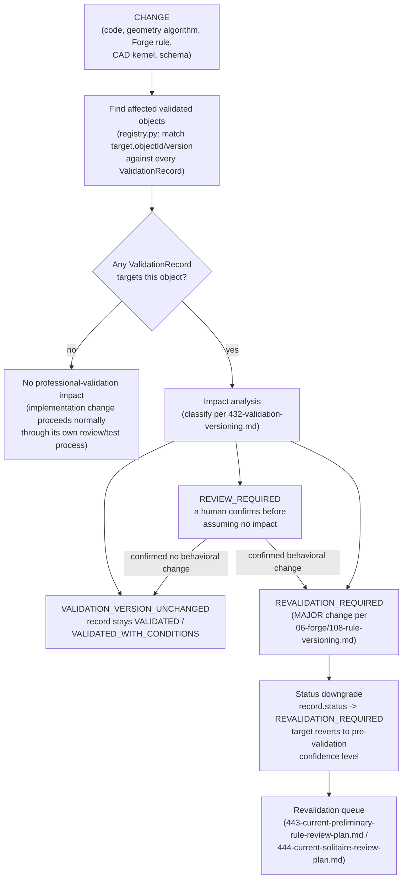

# Implementation Change Impact

## PROVAL-GOV-013

Changes to validated semantics trigger impact analysis. This document
defines the flow
([`410-validation-governance.md`](410-validation-governance.md),
PROVAL-GOV-013): CHANGE → affected validated objects → impact analysis →
status downgrade if necessary → revalidation queue.

## The flow

## Worked example from the original Sprint brief

> Prong-builder algorithm changes substantially. Existing professional
> validation of old prong geometry cannot automatically validate new
> output.

Walking this through the flow above: the CHANGE is a substantial rewrite of
`backend/jewelmind/geometry/components/prongs.py` (a
`geometry_algorithm_change` trigger, per
[`433-validation-expiration-and-revalidation.md`](433-validation-expiration-and-revalidation.md)).
Finding affected validated objects means checking every `ValidationRecord`
in the active registry whose `target.objectType` is
`GEOMETRY_COMPONENT`/`GEOMETRY_RELATIONSHIP`/`COMPLETE_MODEL` and whose
`target.objectId` names the prong component or anything downstream of it
(a basket/prong relationship, a complete solitaire model). Impact analysis
classifies the change: a substantial algorithm rewrite is exactly the
`prong_builder_algorithm_rewritten` scenario already present, generated,
and classified `REVALIDATION_REQUIRED` in
`specs/professional-validation/v1/test-vectors/version-impact-vectors.json`
(see [`432-validation-versioning.md`](432-validation-versioning.md)) —
because the new generator output is not the same geometry the original
reviewer actually looked at, no amount of similarity to the old algorithm
lets the prior record's `VALIDATED`/`VALIDATED_WITH_CONDITIONS` status carry
forward automatically. Every affected record's `status` would be downgraded
toward `REVALIDATION_REQUIRED`, and the affected object(s) would enter the
revalidation queue for a new review against the new algorithm's actual
output.

## This flow has never executed for a real record

Stated plainly, not glossed over: **the active validation registry
(`specs/professional-validation/v1/current-validation-registry.json`)
currently contains zero records** (verified by
`backend/tests/test_professional_validation_registry.py::TestZeroValidationDefault::test_count_validated_on_the_real_registry_is_zero`,
cited in the README's "Current state: zero professional validation"
section). Because there are zero validated objects, the "find affected
validated objects" step of this flow has never, in the real history of this
codebase, actually found a nonempty result — every implementation change
made so far, including substantial ones, has taken the `NOOP` branch of the
diagram above by simple virtue of there being nothing in the registry to
affect. There is also no automated code in
`backend/jewelmind/professional_validation/` today that runs this flow
against a real code diff; the flow is a conceptual model plus the real
classification vocabulary from
[`432-validation-versioning.md`](432-validation-versioning.md), not a
CI-integrated check.

This absence of execution history is itself worth stating directly, rather
than treating the diagram above as proven-in-production: this document
describes a model that is **ready** for the moment JewelMind's registry
holds its first real `VALIDATED`/`VALIDATED_WITH_CONDITIONS` record and a
subsequent implementation change touches that record's target — at that
point, and only at that point, this flow will run for real for the first
time. Until then, PROVAL-GOV-013's flow remains correctly documented,
not-yet-executed infrastructure, exactly as
[`410-validation-governance.md`](410-validation-governance.md) already
states: "currently zero validated objects exist, so this flow has never yet
had to run, but the model exists ready for when it must."
