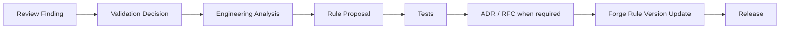
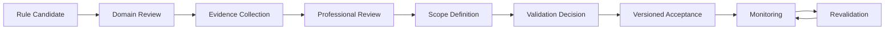

# Validation to Forge Workflow

## A professional finding does not mutate Forge automatically

Every arrow in this diagram is a real, required, human-mediated step. `backend/jewelmind/professional_validation/` has zero imports of `jewelmind.validation.engine` or `jewelmind.validation.rules` anywhere (verified by grep) — no `ValidationRecord`, no `ReviewObservation`, and no code path in this package can write to `backend/jewelmind/validation/engine.py` or `backend/jewelmind/validation/rules.py`. A review finding is data; it has no execution semantics of its own.

## This formalizes, and does not contradict, Sprint 4's own process

`docs/bible/06-forge/103-professional-validation-lifecycle.md` already defines the conceptual flow, quoted directly:

This Sprint's real `ValidationRecord`, `ValidationEvidence`, `ValidationDecision`, and `ValidationScope` schemas (`backend/jewelmind/professional_validation/schemas.py`) are what actually implement Sprint 4's "Evidence Collection", "Professional Review", "Scope Definition", and "Validation Decision" stages — stages that Sprint 4 could only describe conceptually since no machine-readable evidence/decision model existed yet. `103-professional-validation-lifecycle.md`'s "Current state: zero validated rules" section remains accurate — verified live: `specs/professional-validation/v1/current-validation-registry.json` still contains zero records.

## The intermediate steps are mandatory, not optional shortcuts

- **Engineering analysis** — a developer, not the reviewer, determines what code change (if any) the finding actually implies.
- **Rule proposal** — a concrete, specific proposed change (a new threshold, a new classification, a new blocking behavior).
- **Tests** — per PROVAL-GOV-009, no runtime behavior changes without accompanying tests.
- **ADR/RFC when required** — per `docs/bible/06-forge/090-forge-governance.md`'s own existing rule (FORGE-GOV), a MAJOR rule-version change or a new rule family already requires this independent of professional validation; this Sprint adds no exception.
- **Forge rule version update** — per `docs/bible/06-forge/108-rule-versioning.md`, a changed threshold/severity/blocking behavior is itself a MAJOR change, which per [`432-validation-versioning.md`](432-validation-versioning.md) means any *existing* validation of the old version does not automatically carry forward either.

## Cross-references

- [`419-rule-validation-process.md`](419-rule-validation-process.md) — how a rule is actually reviewed in the first place, upstream of this workflow.
- [`432-validation-versioning.md`](432-validation-versioning.md) — what happens to a validation record when the rule it validated changes.
- [`436-validation-to-atlas-workflow.md`](436-validation-to-atlas-workflow.md) — the geometry-side sibling of this workflow.
