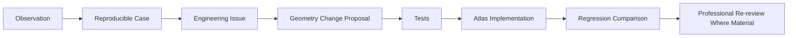

# Validation to Atlas Workflow

## From a geometric observation to an Atlas implementation change

## Reviewer comments never become direct geometry instructions

`ReviewObservation.suggestedChange` (`backend/jewelmind/professional_validation/schemas.py`) is a plain free-text field. There is no code path anywhere in this repository that parses, interprets, or executes the contents of `suggestedChange` to alter a geometry builder function — the text exists to inform a developer's engineering analysis, never to be machine-executed. This mirrors ALCHEMIST-GOV/ATLAS-GOV's own existing boundary (`docs/bible/07-atlas/`, `docs/bible/08-alchemist/`): geometry construction happens exclusively inside `backend/jewelmind/geometry/`, driven by explicit, reviewed code changes — never by a string field.

## Reproducibility is the bridge between "a reviewer said something" and "an engineer can act on it"

An observation alone ("the prong looks too thin here") is not actionable without a **reproducible case** — the exact `JewelryDefinition`, the exact `definitionHash`, and the exact Atlas/generator version that produced the geometry the reviewer was looking at (see [`425-review-case-model.md`](425-review-case-model.md)). Without that, "too thin" cannot be turned into a regression test, because there is nothing fixed to regress against.

## Regression comparison, not blind acceptance

Once a geometry change is implemented, it is verified against the existing geometry regression tests (`backend/tests/test_geometry.py`, per ATLAS-GOV-015) before being considered complete — a change made *because of* professional feedback still has to pass the same automated geometric-fact checks every other geometry change does. Passing those tests is still not itself professional validation (PROVAL-GOV-006) — it only proves the change did what the engineer intended, not that a professional has re-reviewed the new output.

## Professional re-review "where material"

Not every geometry change requires a full re-review — a change judged by the implementing engineer to be cosmetically or structurally trivial relative to what was reviewed may not need one. A change that materially alters the reviewed geometry's shape, dimensions, or construction logic does. [`434-implementation-change-impact.md`](434-implementation-change-impact.md) is where that judgment call is made explicit, never left implicit.

## Cross-references

- [`420-geometry-validation-process.md`](420-geometry-validation-process.md) — what a geometry observation actually looks like.
- [`425-review-case-model.md`](425-review-case-model.md) — the reproducibility mechanism this workflow depends on.
- [`434-implementation-change-impact.md`](434-implementation-change-impact.md) — when a change downgrades or requires revalidation of an existing record.
